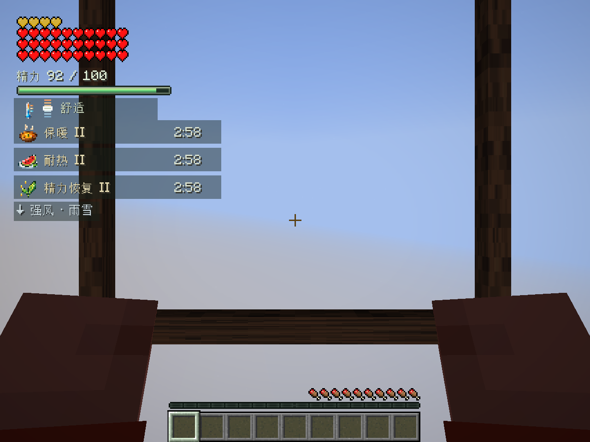

# Wildcraft


> dev.18已接入新版品牌图标：精细版用于项目展示，简单版用于Mod与设置页。[品牌资产与导出](art/brand-v2/A14/v02/README.md)。当前公开交接为 dev.18；dev.17 历史交接与校验继续保留。

Wildcraft 是面向 **Minecraft Java Edition 的 Fabric Mod**，在原版世界中加入精力成长、攀爬、滑翔、单人林克时间、料理、Fuse 和有限能源机械。当前公开开发版本为 **0.1.0-dev.18 / Minecraft 26.3**，功能推进到 P10.2，开发重点是单人体验。

这是可运行的开发交接版。自动验证已覆盖主要玩法循环，人工长期生存、最终平衡和部分美术仍待完成；尚未标记为稳定版。

[下载 dev.18](https://github.com/ibka512/Wildcraft/releases/tag/handoff-dev18-2026-10-06) · [AI 接手说明](docs/AI-HANDOFF.md) · [已采用美术台账](art/ADOPTED-ASSETS.md) · [下一步计划](docs/NEXT-DEVELOPMENT-PLAN.md) · [构建记录](https://github.com/ibka512/Wildcraft/actions/workflows/build.yml)

## 下载与安装

1. 准备 Minecraft **26.3**、Java **25** 和 Fabric Loader **0.19.5**。
2. 将 [Wildcraft dev.18 正式 JAR](https://github.com/ibka512/Wildcraft/releases/download/handoff-dev18-2026-10-06/wildcraft-0.1.0-dev.18%2Bmc26.3.jar) 与 Fabric API **0.161.0+26.3** 放入实例的 `mods/`。
3. 用独立测试世界游玩，升级前备份世界。`-sources.jar` 和 `-gametest.jar` 用于开发，不安装到游玩实例。

正式 JAR SHA-256：

```text
daaa39c4395511671a8ae9d1dcb5f0eca0ea399fe2d9b0ce4ef1ff47f15a869c
```

[交接 Release](https://github.com/ibka512/Wildcraft/releases/tag/handoff-dev18-2026-10-06) 提供正式 JAR、源码 JAR、完整工程交接包、品牌原图与导出包，以及下载校验清单。完整工程含当前源码、测试、美术源稿、文档和历史开发证据；较大的第一批完整交付仍在 [dev.7 历史 Release](https://github.com/ibka512/Wildcraft/releases/tag/handoff-dev7-2026-10-03)，链接和用途见 [资产下载说明](docs/ASSET-DOWNLOADS.md)。

## 已实现的玩法

| 系统 | 当前行为 |
| --- | --- |
| 精力成长 | 记录安装后历史最高经验等级；上限 `100 + 2 × 历史最高等级`，消费经验不降低峰值。普通走路、跳跃、疾跑和游泳不新增费用 |
| 攀爬 | 按住专用键抓墙，上下和横向移动；允许时翻越墙顶；放手、耗尽或受击下落 |
| 滑翔伞 | 生存合成，唯一独立真实装备位；空中再次按跳跃开收伞，双手持伞；取用物品自动收伞，库存不增加或复制 |
| 背负装备与 HUD | 实际使用后登记近战、盾和弓三类视觉引用；披风/鞘翅下使用侧腰布局。左上角红心、下方精力；底部保留原版经验与饥饿 |
| 单人林克时间 | 未开放 LAN 的单人生存世界，空中实际拉弓触发真减速，共享精力；原版一次射箭，有限缓降保留摔落伤害；弩不触发 |
| 料理与温度 | 独立料理锅、七条原版食材配方、四类悬停指引，返还空碗；三种有限效果按有效实际时间计时。七档环境读数，普通冷热不新增普遍惩罚，耐热不等于抗火 |
| 红石与电池 | 固定红石块无限储量但供电限速，相邻充电器共享额度；随身红石块和红石信号不产生电量。电池容量 1000，真实余量保存，重开不回满 |
| 机械安装与回收 | 单主体六节点，右键安装与吸附预览，蹲下空手拆卸，乘坐控制；拆空后回收主体 |
| 八类机械部件 | 翼、风扇、火箭、电池、弹簧、轮子、稳定器、浮力装置；有限电量、一次性燃料、冷却、载重与原版碰撞 |
| 古代装置制造机 | 投入 4 铜＋2 红石，100 世界刻产出一个既定池内部件；一次决定结果并保存，重开或搬运不重抽 |
| Fuse | 主手宿主＋副手单件材料融合，拆分、次数、耐久、维修与保存；剑/斧/盾/箭及飞箭外观和有限特效。未知材料保留快照并通用回退，不承诺每个物品都有专属效果 |
| 风与天气 | 有界自然水平风，当地雨雪、屋顶与水中修正；滑翔伞和离地机械翼响应。临时风提示已经可用，B6 正式美术待制作 |

dev.17 补齐配方书发现提示和料理锅指引，并修复弹簧与原版指南针配方冲突（原料成本不变）；侧装轮子已调整接地显示。详见 [P10.2 规格](docs/P10.2-SPEC.md) 和 [验收](docs/P10.2-VERIFICATION.md)。

| 默认操作 | 用途 |
| --- | --- |
| G 按住；W/S、A/D | 攀爬和沿墙移动 |
| 物品栏独立伞槽；空中再次按跳跃 | 装备、开伞和收伞 |
| 空中使用弓 | 单人林克时间 |
| V / Shift＋V | 融合 / 拆分；材料在副手 |
| 手持部件右键节点 | 安装；蹲下空手右键拆卸 |
| 空手乘坐；R、W/S、A/D | 机械启停、驱动和转向 |
| F8 | 客户端画面设置，关闭表现不关闭技能或费用 |

按键可在原版设置中修改。完整操作、配方与管理员验证入口见 [开发手册](docs/DEVELOPMENT.md)。



## 已采用游戏美术

**核心 14 个编号＋第二批 29 个编号已接入游戏。** 第二批保存 30 份版本交付，F05-10 当前使用 v02，v01 保留历史。模型、像素源稿、动画参考、音效母带、导出、审稿和采用记录均保留来源。

- [当前采用/接入台账](art/ADOPTED-ASSETS.md)：43 项编号的用途、当前版本、源稿和运行入口；提供 [CSV](art/ADOPTED-ASSETS.csv) 和 [JSON](art/ADOPTED-ASSETS.json)。
- [核心原稿](art/approved-v1/README.md) / [核心接入](docs/CORE-ART-INTEGRATION.md)：滑翔伞、角色姿态、背负、精力与专注表现。
- [第二批原稿](art/production-v2/README.md) / [第二批接入](docs/SECOND-ART-INTEGRATION.md)：料理、温度、能源、机械、制造、Fuse、12 段短音及角色复核。
- 待制作：[B6 风与天气](art/production-docs/B6-WIND-ART-BRIEF.md)；待修订：[机械底部部件](art/production-docs/P10.2-MECHANICAL-ART-REPAIR.md)。二者不计入已采用资产。

原交付中的 `integrated: false` 和旧进度文字描述交付当时状态，原件不改写。当前状态以新台账、实际源码与阶段验收为准；审稿模拟不等于实机验收。

## 从源码开发

| 工具 | 锁定版本 |
| --- | --- |
| Minecraft / JDK | 26.3 / 25 |
| Fabric Loader / Fabric API | 0.19.5 / 0.161.0+26.3 |
| Loom / Gradle Wrapper | 1.18.2 / 9.7.1 |

版本集中于 [gradle.properties](gradle.properties)，继续使用已验证环境。推荐 IntelliJ IDEA，项目 Wrapper 管理 Gradle。

```sh
git clone https://github.com/ibka512/Wildcraft.git
cd Wildcraft
# macOS：安装 JDK 25；必要时设置 WILDCRAFT_JAVA_HOME
./dev.sh --version
./dev.sh runDatagen
./dev.sh build gameTestJar
./dev.sh runClient
```

Linux 设置 `JAVA_HOME` 后使用 `./gradlew`，Windows 使用 `gradlew.bat`。资源生成和构建分两次执行；生成资源不手改。`build` 导出安装包到项目 `dist/`。

macOS 默认缓存位于 `~/Library/Caches/Wildcraft`；可用 `WILDCRAFT_CACHE_HOME` 指向其他 APFS 位置。本机工程位于 `/Volumes/仕事/Wildcraft/开发环境/project`，环境详情见 [LOCAL-DEVELOPMENT](docs/LOCAL-DEVELOPMENT.md)，其他电脑不需要本机磁盘映像。

```text
src/main/             公共玩法、数据、资源；独立服务端可加载
src/client/           输入、HUD、模型、界面与数据生成
src/main/generated/   生成配方、模型、语言与发现提示
src/gametest/         服务端/客户端验证与隔离研究
src/rulesTest/        精力、有效时钟、温度和风规则
art/                  已采用原稿、原型、当前台账与制作合同
tools/                美术导入与台账校验
docs/                 设计、规则、架构、验收与 AI 交接
development-assets/   正式历史包、截图、日志与冻结校验
```

## 验证与当前限制

dev.18 品牌更新在 macOS 重新通过 **83 项服务端检查和一类核心美术客户端专项**，验证 Mod 图标、设置页原生 20px 图标和滑翔姿态；通过数据生成及构建。它没有重新运行 dev.17 的全部 21 类客户端回归。证据见 [品牌验收](docs/BRAND-ICONS-VERIFICATION.md)。

dev.17 在 macOS 的历史验证结果：**83 项服务端检查、21 类成品客户端回归通过**；另通过中英料理指引、实际 GUI 缩放 1/2/3、F1/暂停和无测试 Mod 独立服务端检查。原料合成→料理→攀爬/滑翔/射箭→Fuse→充电/驾驶→拆卸/制造→保存重开已走原生路径，完整证据见 [P10.2-VERIFICATION](docs/P10.2-VERIFICATION.md)。该场景提供原版原料并自动布置、定位，未覆盖从零采矿和人工长程生存。

```sh
python3 tools/verify-adopted-assets.py
./dev.sh runDatagen
./dev.sh build gameTestJar
# 操作者自行阅读并接受 Minecraft EULA 后：
./dev.sh -PacceptMinecraftEula=true --no-configuration-cache runPackagedClientTest
```

GitHub [Actions](https://github.com/ibka512/Wildcraft/actions) 检查 Wrapper、生成资源一致性、编译和规则，具体结果以运行记录为准。普通 `test` 没有测试来源，不作为通过证据；Linux 构建不等于 Linux 图形验收。历史报告和校验保持各自阶段身份，按对应 `v0.1.0-dev.*+mc26.3` 标签复核源码，不能要求旧源码校验匹配今天的文档。

仍待完成：人工长期单人生存与续航平衡、B6 正式美术、底部部件穿地修正、第三方模型/装备兼容、多平台图形与性能验收。机械仍采用一个主体碰撞盒，未实现逐部件复杂刚体。**多人局部时间 R2 / P10.1 暂缓**；普通已有同步保留，当前不开展新增多人专项。

## 继续开发与交接

接手顺序：[AGENTS](AGENTS.md) → [AI-HANDOFF](docs/AI-HANDOFF.md) → [下一阶段计划](docs/NEXT-DEVELOPMENT-PLAN.md) → 当前规格和验证。下一步先按 [人工试玩单](docs/SINGLEPLAYER-PLAYTEST.md) 记录真实单人生存，再根据 [数值基线](docs/SINGLEPLAYER-BALANCE.md) 定向调整；同步准备 B6 与机械底部美术，之后进行 P11 候选版检查。

保留完整 Git 历史、dev.1–dev.18 游戏标签、旧包和研究资料。dev.18 游戏标签固定品牌更新版本；`handoff-dev18-2026-10-06` 固定本次交接快照。公开记录见 [PUBLICATION](docs/PUBLICATION.md)，各阶段资产见 [development-assets](development-assets/README.md)。

继续排除究极手、时间倒流、大型 Boss、完整神庙、大型新维度、复杂剧情、大量新矿石/资源体系、小型世界事件、环境谜题和机械蓝图；超复杂机械物理暂缓。任意物品 Fuse 的专属外观、效果与第三方兼容继续作为研究方向。

## 权利与来源

源码与原创美术按 [LICENSE](LICENSE) 保留所有权利；公开可查看不代表采用 MIT 等开放许可证。本次交接不改变许可，Fabric 模板与 Gradle Wrapper 来源见 [NOTICE](NOTICE.md)。项目不是 Nintendo、Mojang 或 Microsoft 的官方产品。

GitHub 分发源码、原创资产和开发证据；个人存档、账号、协议接受文件、Minecraft 游戏/反编译源码及依赖缓存不进入交接包。
