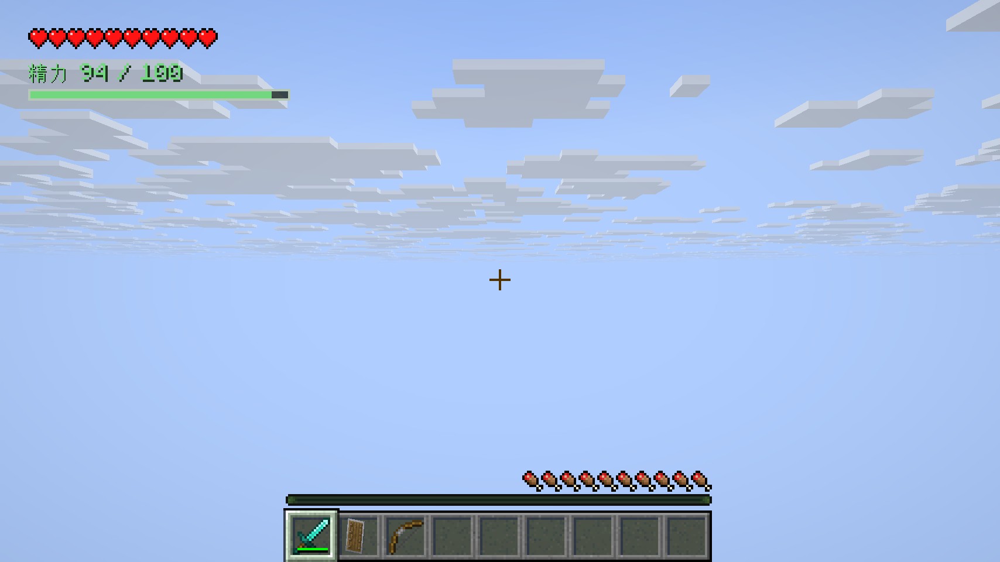
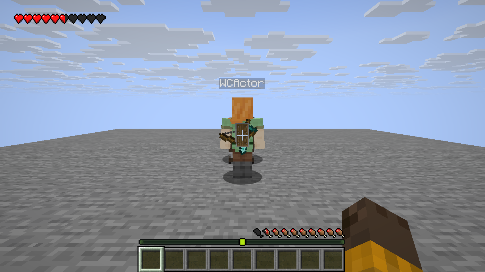

# Wildcraft — Minecraft Java Edition Mod

Wildcraft 是基于原版世界的探索、战斗与机械模组，使用 **Fabric + Java** 开发。当前可运行阶段为 **P3.1**，游戏版本 **`0.1.0-dev.5`**；主要开发环境为 macOS。

本仓库提供完整项目源码、原始设计、可编辑美术、隔离研究、自动测试、历史开发包及实际游戏验证资产。**接手开发从 [AI 开发交接说明](docs/AI-HANDOFF.md) 和 [AGENTS.md](AGENTS.md) 开始。**

[开发路线](docs/ROADMAP.md) · [完整规划 v2](docs/DEVELOPMENT-PLAN-V2.md) · [架构](docs/ARCHITECTURE.md) · [运行与操作手册](docs/DEVELOPMENT.md) · [全部开发资产](development-assets/README.md) · [构建状态](https://github.com/ibka512/Wildcraft/actions/workflows/build.yml) · [公开交接记录](docs/PUBLICATION.md)

## 当前已经实现

| 系统 | 可用行为 |
| --- | --- |
| 玩家成长与精力 | 记录安装后的历史最高经验等级；上限为 `100 + 2 × 历史最高等级`，消费经验不降低上限；保存当前精力与恢复等待 |
| 攀爬 | 按住专用键 G 抓墙；W/S 上下、A/D 横移；放手、耗尽或受伤下落；可在允许空间翻过墙顶 |
| 滑翔伞 | 生存合成、独立真实装备槽；空中重新按跳跃键开/收伞；双手持伞，取用物品自动收伞 |
| 背负装备 | 剑/斧、盾、弓/弩按实际使用登记；单纯切换快捷栏不改历史；物品丢弃、进箱子或损坏后清除 |
| 探索界面 | 左上角原版红心，精力数值与短条在下方；多行/吸收红心自动下移，底部保留原版经验和等级 |
| 保存与联机 | 服务端管理所有权与数值；本人和附近观察者正确接收允许的状态；存档、复活、维度与重连已有验证 |





当前精力样式是数值加短条。首版披风显示时隐藏背负，鞘翅隐藏中央盾/弓；腰侧布局与收取动画尚在后续阶段。

## 下载与安装

- [完整交接下载包与公开说明](https://github.com/ibka512/Wildcraft/releases/tag/handoff-2026-10-03)（包含当前源码及全部归档资产）
- [当前可安装开发包：Wildcraft 0.1.0-dev.5 / Minecraft 26.3](development-assets/wildcraft-0.1.0-dev.5+mc26.3.jar)
- [P3.1 原始源码快照](development-assets/Wildcraft-P3.1-source.zip)
- [所有历史包、报告、截图及校验清单](development-assets/README.md)

在独立 Minecraft **26.3** 实例中安装 Fabric Loader **0.19.5**，把正式 Wildcraft JAR 与 Fabric API **0.161.0+26.3** 放入 `mods/`。客户端与服务端都需要安装。`-gametest.jar` 和 `-sources.jar` 不用于普通游玩。

这是开发版，先使用专门的测试实例与世界备份。主分支包含最新交接文档；`v0.1.0-dev.*+mc26.3` 标签固定对应原始里程碑，历史包没有被新文档覆盖。

## 从源码开始

| 工具 | 固定版本 |
| --- | --- |
| Minecraft Java Edition | 26.3 |
| Java / JDK | 25 |
| Fabric Loader | 0.19.5 |
| Fabric API | 0.161.0+26.3 |
| Fabric Loom | 1.18.2 |
| Gradle Wrapper | 9.7.1 |

使用项目自带 Wrapper，不需要全局安装 Gradle。推荐 IntelliJ IDEA，其他 Java IDE 也可导入 Gradle 工程。构建版本集中在 [gradle.properties](gradle.properties)，本次交接不升级技术栈。

```sh
git clone https://github.com/ibka512/Wildcraft.git
cd Wildcraft
# 先安装 JDK 25；dev.sh 在 macOS 自动选择已安装的 JDK 25
./dev.sh --version
./dev.sh runDatagen
./dev.sh build
./dev.sh runClient
```

需要指定 JDK 时设置 `WILDCRAFT_JAVA_HOME`。Linux 也可用 JDK 25 + `./gradlew`，Windows 使用 `gradlew.bat`；桌面游玩验证目前以 macOS 为主。资源生成和构建按上面顺序分开运行。

`build` 导出正式 JAR 到 `dist/`。macOS 的 Gradle/游戏缓存及可重建输出在 `~/Library/Caches/Wildcraft/`，用于避免 ExFAT 的 AppleDouble 文件干扰；更换项目路径会得到不同的运行目录。不要把个人存档放进自动测试缓存。完整 IDE、命令、服务端和操作说明见 [开发手册](docs/DEVELOPMENT.md)。

## 验证与证据

P3.1 本机实际通过：**13 个数值示例 + 1000 组边界检查、25 项 GameTest、7 组成品客户端测试、两个独立普通图形客户端连接独立服务端，以及无测试模组的独立服务端启动/保存退出**。

```sh
./dev.sh runDatagen
./dev.sh build gameTestJar
```

客户端测试和普通服务端需要接受 [Minecraft EULA](https://www.minecraft.net/en-us/eula)。阅读并自行同意后，再明确添加参数：

```sh
./dev.sh -PacceptMinecraftEula=true --no-configuration-cache runPackagedClientTest
```

普通 `test` 任务没有测试来源，不能把空任务当作通过。公开 CI 检查 Wrapper、资源生成一致性、编译、数值和无图形 GameTest；图形客户端、实际手感和长时间多人另外验收。历史报告中的“远程 CI 尚未运行”描述各里程碑的当时状态；当前远程结果以 [GitHub Actions](https://github.com/ibka512/Wildcraft/actions) 为准。

- [P3.1 实际验收与双客户端重现](docs/P3.1-VERIFICATION.md)
- [P3 滑翔](docs/P3-VERIFICATION.md) / [P2 攀爬](docs/P2-VERIFICATION.md) / [P1 精力](docs/P1-VERIFICATION.md) / [P0 工程](docs/VERIFICATION.md)
- [R0 机械/Fuse 研究](docs/R0-FINDINGS.md) / [R1 单人时间边界](docs/R1-FINDINGS.md)

## 下一步与完整范围

**下一阶段是 P3.2 单人林克时间。** R1 已验证真实减速、正常输入、原版一次射箭、有界费用和时间控制撤销；目前都在隔离测试模块中，尚未成为正式技能。后续实现仅允许未开放联机的单人集成服务端，多人全服减速禁止，局部时间另经 R2 研究。

| 顺序 | 后续交付 |
| --- | --- |
| P3.2 | 单人林克时间，与攀爬、滑翔、双手拉弓及共享精力衔接 |
| P4A / P4B | 轻量环境温度；料理、精力效果与原版细雪辅助，普通冷热不新增普遍伤害 |
| P5 | 红石控制与能源分离，固定无限能源限速，移动使用有限电池 |
| P6 / P7 | 机械主体、有限安装节点、吸附/拆卸回收；翼、风扇、火箭、电池、弹簧、轮子、稳定器、浮力装置 |
| P8 | 古代装置制造机，投入与产出一次、结果保存 |
| P9 / P9.1 | 正式 Fuse；任意物品 Fuse 继续作为研究，效果/保存/显示分别验收 |
| R2 / P10 / P10.1 | 多人局部时间研究、风与天气、经验证的多人林克时间 |
| P10.2 / P11 | 角色与音画完善、长期多人、平衡、兼容及候选版 |

继续不做：究极手、时间倒流、大型 Boss、完整神庙、大型新维度、复杂剧情、大量新矿石/资源体系、小型世界事件、环境谜题、机械蓝图。超复杂机械物理暂缓。技术实验不能当成正式功能已完成。

## 目录与交接

```text
AGENTS.md                  AI 工作边界与接手顺序
src/main/java/             服务端可加载的公共逻辑
src/client/java/           输入、HUD、模型、界面与资源生成
src/main/resources/        元数据、原创贴图、配方与标签
src/main/generated/        可重建的物品模型与中英文资源
src/gametest/              自动验证与隔离研究，不进入正式游戏包
src/rulesTest/             不启动游戏的精力数值检查
art/                       可编辑 SVG、像素源数据及资源说明
docs/                      规则、架构、路线、原始设计、验收与 AI 交接
development-assets/        全部历史交付、研究证据、截图与诊断记录
```

AI 接手说明包含已有用户决定、代码入口、保存/网络边界、R1 提取注意事项、重现流程、验收标准和未完成事项。原始四份设计及来源哈希保存在 [design-inputs](docs/design-inputs/2026-10-02/SOURCES.json)，原始输入 ZIP 也已归档；它们是需求资料，不能把其中示例或旧建议覆盖用户后续决定。

## 权利与来源

项目源码和原创美术仍按 [LICENSE](LICENSE) 保留所有权利，**公开可查看不代表已选择 MIT 等开源许可证**。本次上传未变更授权方式。Fabric 模板和 Gradle Wrapper 的来源与各自许可证见 [NOTICE.md](NOTICE.md)。

本仓库不分发 Minecraft 游戏文件、下载依赖缓存、个人世界、账号凭据或已接受协议的运行配置。构建工具按需下载第三方依赖。本项目不是 Nintendo、Mojang 或 Microsoft 的官方产品，原创资源未复制塞尔达贴图或模型。
