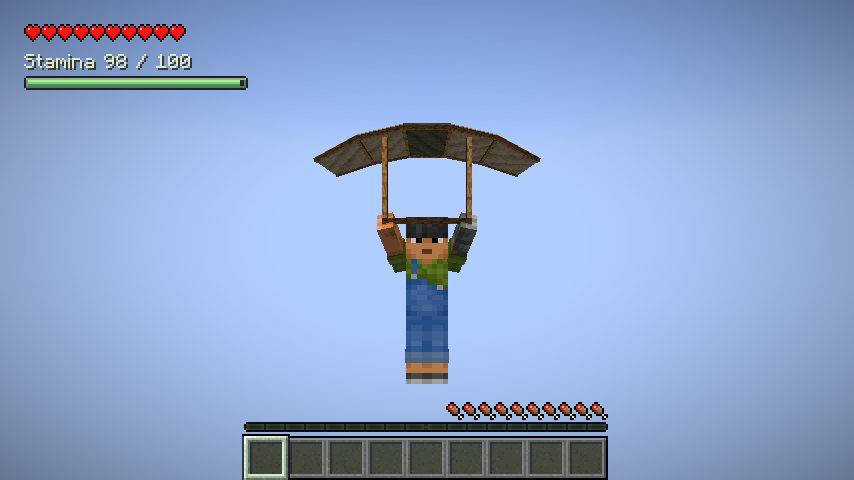
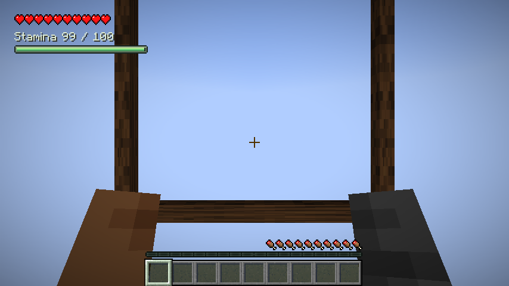
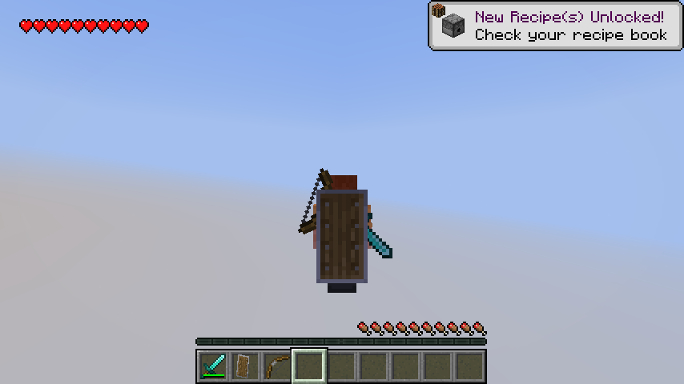

# Wildcraft

Wildcraft 是基于 Minecraft 原版世界的探索、战斗与机械 Mod，采用 **Java Edition + Fabric**。当前本机开发版本为 **0.1.0-dev.10 / Minecraft 26.3**，已完成精力、攀爬、滑翔、背负装备、单人林克时间、核心美术 v1、P4A 环境温度和 P4B料理和P5能源。正式机械及Fuse尚未实现。公开 main 与最新 Release 仍为 dev.7，本次dev.8–dev.10尚未上传。

本仓库供继续开发与 AI 接手使用，包含当前源码、可编辑美术、玩法规则、隔离研究、测试和历史验收资产。它是开发版，尚未完成完整生存平衡或长期兼容验收。

**接手入口：[AGENTS.md](AGENTS.md) → [AI 开发交接](docs/AI-HANDOFF.md) → [下一阶段执行计划](docs/NEXT-DEVELOPMENT-PLAN.md)。**

[下载本次交接](https://github.com/ibka512/Wildcraft/releases/tag/handoff-dev7-2026-10-03) · [开发手册](docs/DEVELOPMENT.md) · [架构与保存边界](docs/ARCHITECTURE.md) · [路线图](docs/ROADMAP.md) · [全部历史资产](development-assets/README.md) · [构建状态](https://github.com/ibka512/Wildcraft/actions/workflows/build.yml)

## 已实现的玩法

| 系统 | 当前行为 |
| --- | --- |
| 精力与成长 | 记录安装后的历史最高经验等级；基础上限 `100 + 2 × 历史最高等级`；消费经验不降低上限；保存精力与恢复等待 |
| 攀爬 | 按住 G 抓墙，W/S 上下、A/D 横移；可在碰撞允许时翻越墙顶；放手、耗尽或受击下落 |
| 滑翔伞 | 生存合成；专用真实装备位；空中重新按跳跃键开收伞；双手持伞，取用物品自动收伞，真实物品仍在库存 |
| 背负装备 | 剑/斧、盾、弓/弩实际使用后登记；仅切快捷栏不登记；三个视觉引用不增加容量，失去真实物品后清除 |
| 探索界面 | 原版红心在左上角，精力数值与短条在下方；多行红心自动适配；底部保留原版经验、饥饿和骑乘显示 |
| 单人林克时间 | 未开放 LAN 的单人生存世界，空中实际拉弓自动真减速；共享精力，保持原版射箭语义，有限缓降且保留摔落伤害；F8 调整画面 |
| 环境温度 P4A | 群系、当地雨雪、浸水和可见热源影响七档读数；左上角平滑显示；F8 关闭边缘色调；普通冷热无额外惩罚，原版细雪/皮革规则保留 |
| 料理 P4B | 独立料理锅与七条原版食材配方，吃完返还空碗；三类有限效果、有效实际计时；暂停/离线停止，死亡清除，保暖不能完全免疫细雪 |
| 红石能源 P5 | 固定红石块无限储量、每源/每充电器20能量/世界刻上限；相邻充电器共享并轮流供电，信号和随身红石块不产生电量 |
| 有限电池 P5 | 空电池容量1000，充电器显示进度；实际堆栈存余量，取出消费、掉落或重载不回满；机械动力留到P6 |
| 核心美术 v1 | 原创滑翔伞网格、标准/细手臂握持和攀爬姿态、五类背负挂点与短落定、精力图集、专注画面/音效及设置页 |







首版披风可见时隐藏三类背负，鞘翅隐藏中央盾/弓；腰侧布局仍待完善。弩不触发林克时间；多人局部林克时间尚未实现，联机不会降低全服速率。精力目前采用数值加短条。详细操作与限制见 [开发手册](docs/DEVELOPMENT.md) 和各阶段规则。

## 下载与安装

- **本机最新开发包：[wildcraft-0.1.0-dev.10+mc26.3.jar](development-assets/wildcraft-0.1.0-dev.10+mc26.3.jar)**；已公开交接包仍为 [dev.7](development-assets/wildcraft-0.1.0-dev.7+mc26.3.jar)。
- [本次 GitHub Release](https://github.com/ibka512/Wildcraft/releases/tag/handoff-dev7-2026-10-03)：正式 JAR、最新源码与仓库资产 ZIP、完整美术交付再归档、桌面美术工作目录及 SHA-256 校验清单。
- [全部历史阶段及校验](development-assets/README.md)：dev.1–dev.6 的原始包和证据继续保留。

在独立 Minecraft **26.3** 实例安装 Fabric Loader **0.19.5**，将 Wildcraft 正式 JAR 与 Fabric API **0.161.0+26.3** 放入 `mods/`；客户端与服务端均需安装。不要安装 `-gametest.jar` 或 `-sources.jar`。开发阶段使用专用测试世界，升级前保留世界备份。

已公开 dev.7 JAR SHA-256（历史包保持不变）：

```text
91b8a92e9eb69119b8a663c29d0f259e9a0bff4fd98ba2d1a6ad87305af6232a
```

本机 dev.8 JAR SHA-256：`8207d202de9a6375057b046cf497d6fd377043dcaa22cfe53149e2238caee1fa`。本阶段 [验证](docs/P4A-VERIFICATION.md)、[资产校验](development-assets/Wildcraft-P4A-SHA256SUMS.txt) 随开发分支保存。

`v0.1.0-dev.*+mc26.3` 标签固定游戏里程碑；`handoff-dev7-2026-10-03` 固定本次交接文档与构建入口。旧交接 [handoff-2026-10-03](https://github.com/ibka512/Wildcraft/releases/tag/handoff-2026-10-03) 仍对应 dev.5，不代表当前版本。

## 从源码构建

| 工具 | 固定版本 |
| --- | --- |
| Minecraft Java Edition | 26.3 |
| JDK | 25 |
| Fabric Loader | 0.19.5 |
| Fabric API | 0.161.0+26.3 |
| Loom | 1.18.2 |
| Gradle Wrapper | 9.7.1 |

版本集中于 [gradle.properties](gradle.properties)。使用项目 Wrapper，不需要安装全局 Gradle。推荐 IntelliJ IDEA，继续使用已验证技术栈。

```sh
git clone https://github.com/ibka512/Wildcraft.git
cd Wildcraft
# macOS 先安装 JDK 25；必要时设置 WILDCRAFT_JAVA_HOME
./dev.sh --version
./dev.sh runDatagen
./dev.sh build gameTestJar
./dev.sh runClient
```

Linux 设置 JDK 25 后使用 `./gradlew`，Windows 使用 `gradlew.bat`。首次构建需要联网下载依赖。`build` 将正式安装包导出至项目 `dist/`；生成资源由 `runDatagen` 维护，不手改 `src/main/generated/`。

macOS 默认将可重建缓存与运行目录放在 `~/Library/Caches/Wildcraft`。可用 `WILDCRAFT_CACHE_HOME` 将缓存、输出和双客户端实验目录统一放在其他 **APFS** 位置；`GRADLE_USER_HOME` 与 `WILDCRAFT_PROJECT_CACHE` 的显式设置仍优先。默认克隆不要求本机外置盘或开发磁盘映像。

项目所有者当前本机工程已集中至 `/Volumes/仕事/Wildcraft`，采用盘内 APFS 磁盘映像保存工程、JDK、缓存与测试目录。挂载后工程在 `开发环境/project`，`dev.sh` 自动识别相邻的本机运行标记；详情见 [本机迁移与开发入口](docs/LOCAL-DEVELOPMENT.md)。该本机环境及游戏缓存不随 GitHub 分发。

## 验证与可信范围

核心美术基线已在 macOS 实际通过：精力 **13 个示例 + 1000 组边界检查**、有效时钟 **10 项检查**、**28 项服务端 GameTest**、**9 类成品客户端回归**、两个独立普通客户端观察，以及无测试模组独立服务端启动和保存退出。本机 P4A 已扩展到 **32 项服务端 / 10 类成品客户端回归**，新增温度规则、专项客户端与生命周期检查，见 [P4A 验证](docs/P4A-VERIFICATION.md)。另有 120fps、30fps、附魔及服务端阻塞四种普通客户端真实计时。证据见 [核心美术验收](docs/CORE-ART-VERIFICATION.md)；本次迁移验证单独记录在 [迁移与交接记录](docs/MIGRATION-HANDOFF-2026-10-03.md)。

```sh
./dev.sh runDatagen
./dev.sh build gameTestJar
```

图形测试及普通服务端需要操作者自行阅读并接受 [Minecraft EULA](https://www.minecraft.net/en-us/eula)。接受后才添加以下参数：

```sh
./dev.sh -PacceptMinecraftEula=true --no-configuration-cache runPackagedClientTest
./dev.sh -PacceptMinecraftEula=true --no-configuration-cache runCoreArtClientTest
```

普通 `test` 没有测试来源，不算测试通过。GitHub CI 检查 Wrapper、资源生成一致性、编译、规则和无图形服务端测试；实际图形、手感与长期多人另外验收，以 [Actions](https://github.com/ibka512/Wildcraft/actions) 的具体运行结果为准。

未覆盖：所有真实账号皮肤/披风、第三方动画与模型、主观混音、长期高延迟或丢包、Windows/Linux 图形游玩。历史证据保留其当时状态，不把研究成功写成正式系统完成。

## 下一阶段

P4A、P4B和P5已完成本机开发，规则和验收见[P5规格](docs/P5-SPEC.md) / [P5验证](docs/P5-VERIFICATION.md)。下一步P6机械主体、风扇/电池和安装回收；[准备与测试矩阵](docs/P6-PREPARATION.md)已整理，安装交互待用户选择。保留普通冷热无普遍惩罚、有限冻结辅助、耐热不抗火。

| 顺序 | 后续范围 |
| --- | --- |
| P4B（已完成） | 独立料理锅、七条配方、有效实际时长、有限细雪与恢复辅助 |
| P5（已完成） | 红石信号与电量分离、固定无限能源限速、充电器和有限电池 |
| P6 / P7 | 主体、有限安装节点、吸附/拆卸回收；翼、风扇、火箭、电池、弹簧、轮子、稳定器、浮力装置 |
| P8 | 古代装置制造机；投入一次、确定结果保存、中断恢复 |
| P9 / P9.1 | 正式 Fuse 与背负/空中箭整合；任意物品 Fuse 的保存、通用规则、专属效果和外观分别研究 |
| R2 / P10 / P10.1 | 多人局部时间研究、风与天气、通过研究后实现多人林克时间 |
| P10.2 / P11 | 剩余角色表现、平衡、兼容、长期多人、存档升级与候选版 |

具体任务和各阶段验收见 [下一阶段计划](docs/NEXT-DEVELOPMENT-PLAN.md)。继续排除究极手、时间倒流、大型 Boss、完整神庙、大型新维度、复杂剧情、大量新矿石/资源体系、小型世界事件、环境谜题及机械蓝图；超复杂机械物理暂缓。

## 文件地图与接手顺序

```text
AGENTS.md                  用户决定、工程边界及执行规则
src/main/                  服务端可加载的公共逻辑与运行资源
src/client/                输入、HUD、渲染、界面和数据生成
src/main/generated/        生成模型与中英文资源
src/gametest/              服务端/客户端检查及隔离研究
src/rulesTest/             精力、有效时钟和温度平滑/回差规则检查
art/approved-v1/           当前采用的 Blender、像素、配置等源稿
art/tools/                 网格和角色姿态转换工具
art/production-docs/       美术制作进度、资产清单与后续制作规划
docs/                      规则、架构、路线、原设计、验收、AI 交接
development-assets/        历史 JAR/源码包、截图、日志和校验清单
```

- [AI-HANDOFF](docs/AI-HANDOFF.md)：已有决定、代码入口、保存与网络边界、复现流程和下一任务。
- [核心美术接入](docs/CORE-ART-INTEGRATION.md) / [源文件索引](art/README.md)：运行资源和可编辑原件的对应关系。
- [原始设计来源](docs/design-inputs/2026-10-02/SOURCES.json)：四份设计与输入哈希；原文示例、旧建议不覆盖用户后续决定。
- [大文件与原始资产索引](docs/ASSET-DOWNLOADS.md)：Release 下载、采用状态、来源和校验。
- [公开交接记录](docs/PUBLICATION.md)：dev.5 初次交接及本次 dev.7 更新。

源码克隆加本次 Release 的美术包，可取得接手所需的当前实现和全部设计/开发美术资料。个人存档、账号、已接受 EULA 的运行文件、Minecraft 游戏文件、反编译源码及依赖缓存只在本机保存，不公开分发。

## 权利与来源

源码与原创美术按 [LICENSE](LICENSE) 保留所有权利。公开可查看不代表采用 MIT 等开放许可证，本次交接不改变许可。Fabric 模板与 Gradle Wrapper 来源见 [NOTICE.md](NOTICE.md)。本项目不是 Nintendo、Mojang 或 Microsoft 的官方产品；原创资产未复制塞尔达贴图或模型。

本机 P4B：37 项服务端、11 类成品客户端候选回归及无测试模组服务端通过；原型美术可编辑，详见 P4B-VERIFICATION。当前未发布，长期多人争抢与最终生存平衡仍待后续验收。

本机dev.9安装包 SHA-256：`37cd31c0e716edb07e4d7d14c6d5d25e2357addb53bda500e1e2daf1598c566d`。

本机dev.10：40项服务端、12类候选客户端回归、最终能源专项和独立服务端通过；SHA-256：`1e7a0ec8e3fb6b630b62f071fb660771a8d816fa454a6a418163864f3986ca39`。验证和限制见P5-VERIFICATION。
