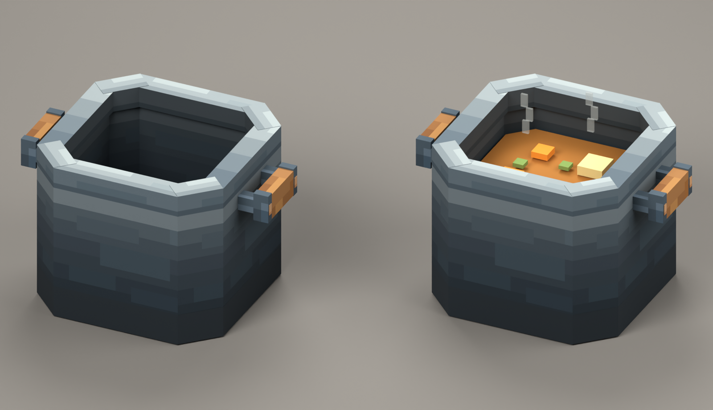

# F01-01 料理锅设计稿 v01

2026-10-04制作，2026-10-05用户采用。**状态：已采用，未接入游戏。**

左为空锅，右为同一锅体的烹饪表现示意。图中的锅是实际方盒模型与64×64像素UV材质的Blender渲染；汤、食材和蒸汽只存在于独立示意场景，不在游戏模型导出中，也不是下一项四类料理资产。灯光为展示照明，最终游戏内光照另行验证。

造型：切角宽口锅、厚锅沿、完整内腔、平底、两侧木柄、少量铜扣。锅壁有分层明暗与锻面像素簇；锅底和锅身齐平，无腿或底座。此前有黑斑的重叠面已处理。

## 源稿与导出

| 文件 | 用途与状态 |
| --- | --- |
| [模型源稿 .blend](source/cooking-pot-v01.blend) | 已重新打开检查，36个生产方盒，材质图片已内嵌；无汤/蒸汽示意内容 |
| [Blockbench源稿 .bbmodel](source/cooking-pot-v01.bbmodel) | Java方块模型格式，显式UV、36方盒与内嵌贴图；本轮校验JSON结构，未在Blockbench中打开 |
| [材质源稿 .aseprite](source/cooking-pot-atlas-64.aseprite) | 原生64×64、RGB、2图层；保存并重新打开，与PNG像素哈希一致 |
| [UV贴图 .png](exports/cooking-pot-atlas-64.png) | 64×64，外壁/内壁/锅沿/内底/木柄/铜扣/支架/锅底共享一图集 |
| [方块模型导出 .json](exports/cooking-pot.block-model.json) | 36方盒，12个含±45°旋转，显式UV；候选导出，未替换当前运行资源 |
| [几何与UV说明](source/geometry-and-uv.json) | 名称、尺寸、旋转轴、UV、显示变换和碰撞规格 |
| [实际颜色参考表](source/material-palette.json) | RGB色表，供吸管/材质修订参考；不把RGB源稿称作索引色文件 |
| [制作简报](brief.md) | 造型、语义、尺寸与制作边界 |

## 审稿与尺寸检查

- [空锅三分之四视角](review/cooking-pot-idle.png)、[正面](review/cooking-pot-front.png)、[俯视](review/cooking-pot-top.png)。
- [俯视尺寸与现碰撞框](review/dimensions-top.svg)：锅体(2,0,2)→(14,10,14)，12×10×12；把手总跨度x0…16，不扩大碰撞。
- [UV分区与8倍最近邻显示](review/uv-layout-guide.svg)：保留64px原件，用SVG说明分区和放大显示。本机Aseprite的512px放大PNG导出未成功，不作为正式输出。
- [火源叠放示意](review/cooking-pot-heat-source-mockup.png)：以简化体块示意锅与下方火源的位置，不是原版营火资产或Minecraft实机截图，不改变热源规则。
- [生图造型参考](references/cooking-pot-concept-v01.png)、[原提示词](references/imagegen-prompt.md)。使用内置生图工具，无CLI/API回退。参考图与实际模型分开保留。

## 通过的本轮检查

已校验模型JSON、36个方盒与合法旋转、显式UV范围、UV覆盖的不透明像素、锅体/把手边界；重开Aseprite源稿与PNG，像素哈希一致；重开Blender源稿，确认36生产模型件、1内嵌材质图片且没有烹饪示意内容。已查看实际模型渲染，修正首轮锅沿/扣件共面黑斑与底座感。

尚未执行游戏资源生成、构建或实机流程；不以以上检查宣称游戏验证通过。详细见[检查记录](verification.md)与[机器可读结果](review/asset-checks.json)。

采用记录已写入[adoption.json](adoption.json)。后续接入按开发任务安排进行。锅的现菜单/碰撞/热源不改，世界烹饪表现须有真实状态数据才接入。下一项为F01-02四类料理外观。
