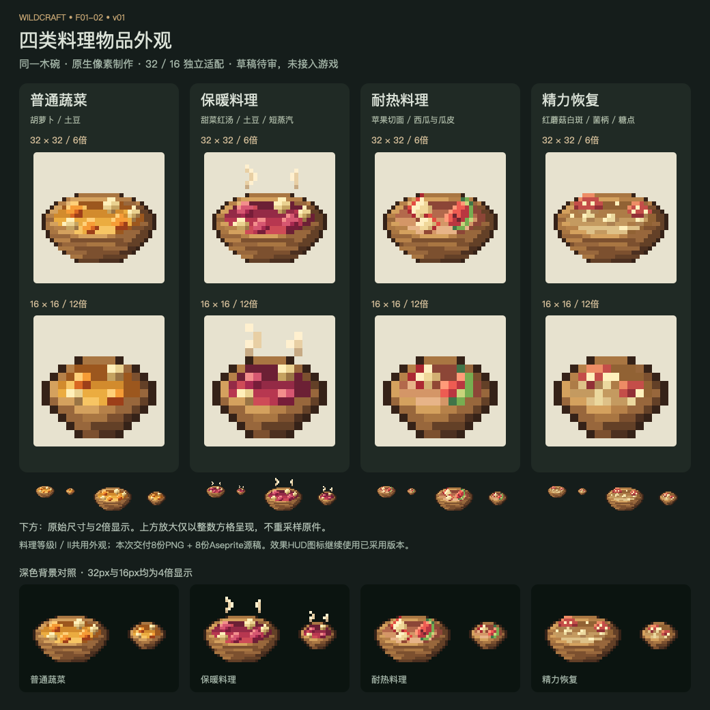

# F01-02 四类料理物品外观 v01

2026-10-05。**状态：2026-10-05已采用，未接入游戏。**

四类料理共用一个宽口木碗，上左光，后沿亮面、前沿遮挡与宽底；普通菜用橙色胡萝卜/奶黄土豆，保暖用甜菜红汤/短蒸汽，耐热用苹果切面/西瓜皮，精力恢复用红蘑菇白斑/菌柄。图中食物依据现有配方，不引入新食材或盘子。

## 导出与可编辑源稿

| 料理 | 32×32导出 / 源稿 | 16×16导出 / 源稿 |
| --- | --- | --- |
| 普通蔬菜 | [PNG](exports/meal-vegetable-32.png) · [Aseprite](source/meal-vegetable-32.aseprite) | [PNG](exports/meal-vegetable-16.png) · [Aseprite](source/meal-vegetable-16.aseprite) |
| 保暖 | [PNG](exports/meal-warming-32.png) · [Aseprite](source/meal-warming-32.aseprite) | [PNG](exports/meal-warming-16.png) · [Aseprite](source/meal-warming-16.aseprite) |
| 耐热 | [PNG](exports/meal-cooling-32.png) · [Aseprite](source/meal-cooling-32.aseprite) | [PNG](exports/meal-cooling-16.png) · [Aseprite](source/meal-cooling-16.aseprite) |
| 精力恢复 | [PNG](exports/meal-recovery-32.png) · [Aseprite](source/meal-recovery-32.aseprite) | [PNG](exports/meal-recovery-16.png) · [Aseprite](source/meal-recovery-16.aseprite) |

每份源稿均为RGB、单帧、4图层：共享木碗、食材与汤汁、前沿遮挡与木纹、蒸汽。只有保暖料理的蒸汽层有像素。同分辨率下的两层木碗在四类中完全相同；16px独立安排碗沿厚度和食材数量，不通过缩小32px生成。

## 制作与参考

使用内置生图工具生成[家族造型参考](references/meal-family-concept-v01.png)，提示词见[记录](references/imagegen-prompt.md)。这张参考图不是原生像素资产，未裁切或缩小为正式PNG。

原生稿通过Aseprite Web的标准绘制命令完成。[像素设计数据](source/pixel-designs.json)保留各层的具体像素；[制作简报](brief.md)说明语义与范围。[审稿SVG](review/meal-family-review.svg)逐格展示实际导出PNG，PNG审稿图由本机Quick Look渲染该文档，放大不改原件。

## 检查与后续接入

8/8文件已重开Aseprite源稿和PNG，复合像素哈希全部一致；PNG逐像素符合设计数据，实际尺寸为32×32或16×16，透明度仅0/255。同分辨率下的共享碗图层相同。实际不透明颜色18–26种，是RGB色阶，未把默认编辑器调色板宣称为索引色表。见[验证说明](verification.md)和[检查记录](review/asset-checks.json)。

后续客户端/资源生成按MEAL_DATA.kind选择0蔬菜/1保暖/2耐热/3精力恢复。7种配方归4种外观，I/II共用外观；等级与时长不烘焙到贴图。32/16不表示等级，接入阶段按资源分辨率方案选用。消耗后仍返回原版空碗。现有已采用料理效果图标保留作HUD资源，不以本次食品图替换。

此轮未修改生产资源或代码，未运行游戏资源生成/构建/实机验证；本次设计已由用户采用，见[采用记录](adoption.json)。下一项为F01-03三类效果图标接入及HUD排布。
