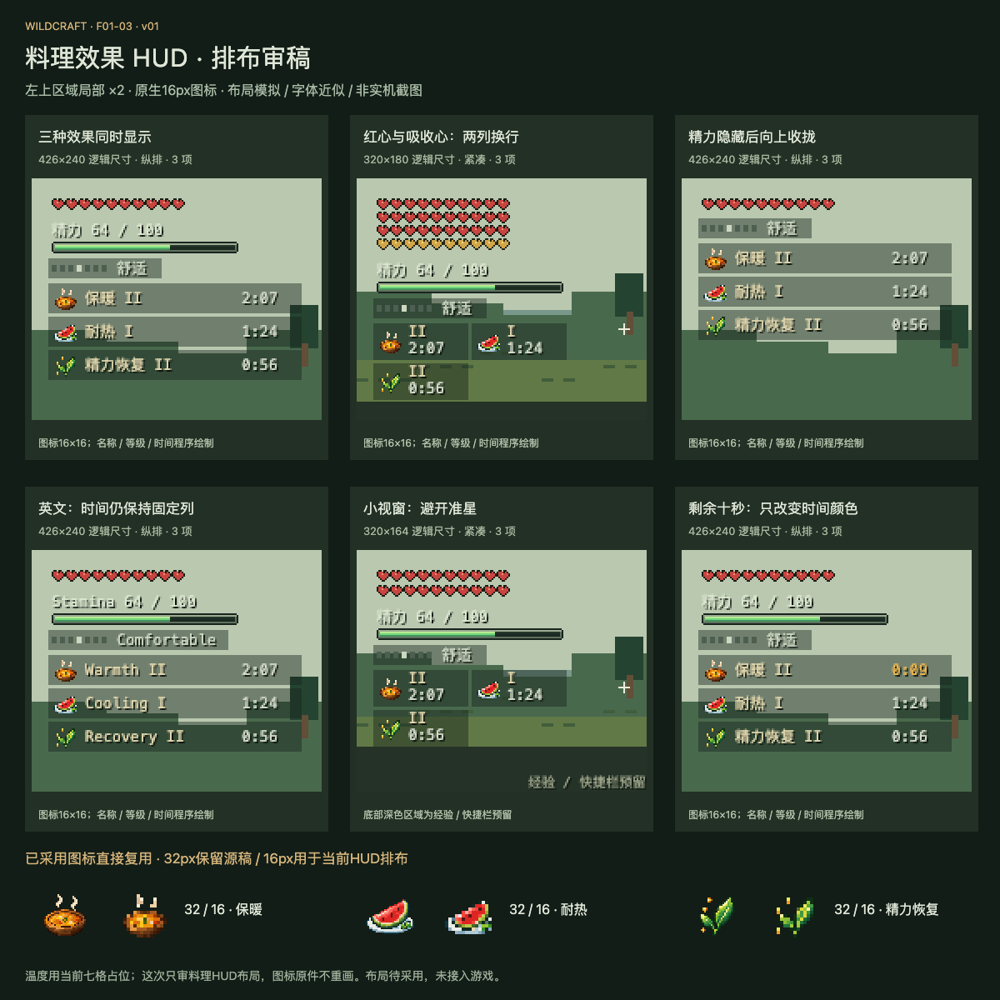

# F01-03 三类料理效果HUD布局 v01

2026-10-05。**状态：2026-10-05新布局已采用；三类图标复用已采用原件；未接入游戏。**

[打开交互审稿页](review/preview.html)：切换9场景、中英文、精力显示、1/2/3整数倍、保暖秒数与边界检查。时间滑块是选择状态快照，不是另一套游戏时钟。

保留红心 → 精力 → 温度 → 料理的顺序，默认纵排三项；每项有16px图标、名称与等级、固定位置倒计时。小视窗/多排心转为紧凑小组，需要时两列换行，避开准星；等级和时间仍保留。精力隐藏时温度及料理向上收拢24逻辑像素。十秒内仅时间文字变琥珀，零秒移除收拢，不闪烁。

## 复用资产

| 用途 | 原生16px（HUD排布） | 原生32px（保留源稿） |
| --- | --- | --- |
| 保暖 | [PNG](exports/warmth-meal-16.png) · [源稿](source/warmth-meal-16.aseprite) | [PNG](exports/warmth-meal-32.png) · [源稿](source/warmth-meal-32.aseprite) |
| 耐热 | [PNG](exports/cooling-meal-16.png) · [源稿](source/cooling-meal-16.aseprite) | [PNG](exports/cooling-meal-32.png) · [源稿](source/cooling-meal-32.aseprite) |
| 精力恢复 | [PNG](exports/stamina-recovery-16.png) · [源稿](source/stamina-recovery-16.aseprite) | [PNG](exports/stamina-recovery-32.png) · [源稿](source/stamina-recovery-32.aseprite) |

6PNG/6Aseprite均直接复制已采用稿，哈希保持一致；没有重画图标或自动缩小32px，具体来源见[清单](references/reused-assets.json)。无需生成新图集；名称、等级、数字、背景色与位置由程序绘制，不烘焙为UI贴图。

## 规范、模拟与检查

- [制作简报](brief.md)、[布局/状态/资源映射JSON](exports/meal-hud-layout.json)、[后续接入映射](integration-map.md)。
- [标准完整视窗](review/hud-standard-simulation.png)、[多排心完整视窗](review/hud-hearts-simulation.png)、[小视窗完整视窗](review/hud-short-simulation.png)，均为模拟。
- [验证说明](verification.md)、[图标源稿重开检查](review/icon-verification.json)、[浏览器交互检查](review/browser-verification.json)、[9场景具体坐标](review/layout-scenarios.json)。

9场景布局检查通过：心/温度下方、不重叠、保留底部空间、避开准星；原生图标的不透明像素在模拟中与原件一致。实际切换过秒数0/600、语言、精力显示与整数倍。6份源稿及6PNG通过Aseprite重新打开，复合像素一致。

审稿图由真实PNG与浏览器布局渲染生成。图中红心/吸收心为位置示意，精力条为当前接入纹理；温度是现七格占位，景物和底部区域为简单示意，字体为浏览器近似。不能将这些图宣称为Minecraft实机截图，未验证实际字体及各GUI设置。

新布局已采用，见[采用记录](adoption.json)；尚未执行生产接入、游戏构建与实机验证。下一项F02-01为七档温度HUD与图标，将与本组联合对齐。
