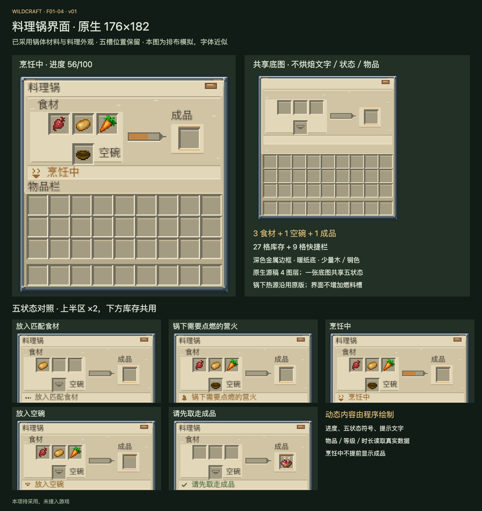

# F01-04 料理锅界面 · v01

2026-10-05。**状态：2026-10-05已采用，交付齐全，未接入游戏。**上一项 F02-01 七档温度 HUD 已根据用户“采用，你可以继续了”登记采用。

界面沿用已采用料理锅的深色金属、暖纸底和少量木／铜色；保持 Minecraft 的槽位阅读方式。真实界面为176×182，三个食材、一个空碗、一个成品槽，下方27格库存及9格快捷栏。热源来自锅下，不新增燃料槽、开始按钮或配方书。

## 源稿与导出

| 文件 | 用途 |
| --- | --- |
| [原生底图 PNG](exports/cooking-ui-176x182.png) | 176×182，16种不透明色，透明切角；共享五状态，无文字、物品和动态进度 |
| [Aseprite 源稿](source/cooking-ui-176x182.aseprite) | RGB，单帧，4图层，已保存重开并核对PNG像素 |
| [界面规范](exports/cooking-ui-layout.json) | 固定41槽坐标、五状态、文本锚点、动态进度与边界 |
| [像素设计数据](source/ui-pixel-design.json) | 每层的原生像素段与材质色表，可重新通过编辑器绘制 |
| [交互预览文件](review/preview.html) / [本机预览](http://127.0.0.1:8805/preview.html) | 五状态、中英文、整数倍显示、进度、槽边界、成品悬停语义示意 |
| [五状态中文／英文完整稿](review/states/) | 10张完整176×182模拟PNG，库存共享，不是十份运行贴图 |
| [成品悬停英文模拟](review/output-tooltip-en-simulation.png) | 保暖II、3:00与返还空碗的语义示意，真实提示框继续由游戏渲染 |
| [制作简报](brief.md) / [后续接入说明](integration-map.md) | 设计意图、素材复用与实机待检查点 |
| [检查说明](verification.md) / [交付清单](manifest.json) | 尺寸、像素、状态与文件哈希证据 |

## 五状态

| 状态值 | 显示内容 | 槽位与进度语义 |
| --- | --- | --- |
| 0 | 放入匹配食材 | 缺食材或未匹配；不能显示“已经就绪” |
| 1 | 锅下需要点燃的营火 | 有匹配食材和空碗，缺有效热源；不是缺界面燃料 |
| 2 | 烹饪中 | 进度按真实值填充，提交前成品槽为空 |
| 3 | 放入空碗 | 空碗必须是真实输入；底图碗轮廓只是空槽提示 |
| 4 | 请先取走成品 | 已提交的实际料理在成品槽中，进度归零 |

状态文字沿用现有中英文翻译，旁边新增程序绘制的小符号。优先级按源码：成品占用→配方未匹配→缺碗→缺热源→烹饪。烹饪途中缺热源或移走碗时保留现有进度，不能让美术状态改变实际逻辑。

## 制作与检查

内置生图工具用于[风格参考](references/cooking-ui-concept-v01.png)，[提示词](references/imagegen-prompt.md)完整保留。参考图并未裁切、缩小或直接用作底图；底图按真实坐标在 Aseprite Web 原生绘制。4层分别为外框／铆钉、纸面／底板、固定槽框、进度轨道／空碗提示。

已验证源稿与PNG重开一致、逐像素匹配设计数据，以及5状态×2语言×4显示倍数共40组预览。正式物品图复用F01-02已采用16px料理；食材／原版空碗为本机原版参考。预览字体近似，原版字体、提示框与真实物品数量还需游戏接入后检查。

本轮未修改 Java、生成运行资源或 dev.14 游戏包，未执行游戏构建／实测。源稿及导出已齐，采用记录见[adoption.json](adoption.json)；下一项为 F04-01 有限电池正式外观。
