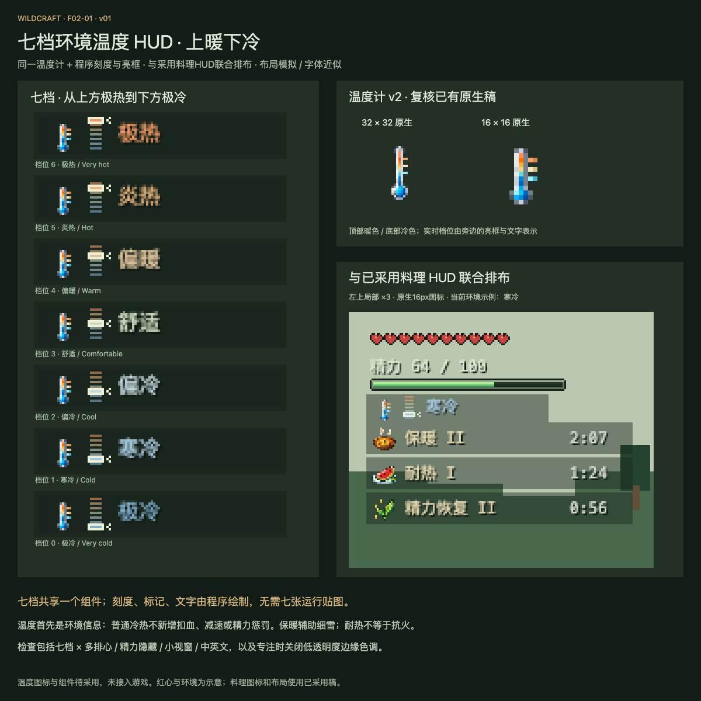

# F02-01 七档环境温度 HUD · v01

2026-10-05。当前温度图标与新组件已于2026-10-05由用户采用，**交付齐全，未接入游戏**。采用证据为“采用，你可以继续了”，详见 [采用记录](adoption.json)。

## 本项交付

沿用已有温度计 v2 的原生 16×16、32×32 图标，复核源稿；新制七档组件与料理 HUD 联合排布。温度计顶部暖色、底部冷色；旁边刻度从上方极热到下方极冷，当前档位用亮框、指示和文字共同表示。温度计是静态环境标识，底部蓝色泡不代表“此刻寒冷”。

七档共享一套组件，刻度、标记、文字和背景由程序绘制，不增加七份状态纹理。16×16 用于常规 HUD，32×32 为同设计的较大图标版本。显示放大使用整数倍像素缩放，两个原生版本均保留。

| 文件 | 用途 |
| --- | --- |
| [交互预览](review/preview.html) | 七档、九场景、中英文、精力显隐、倒计时与边缘色调切换 |
| [本机交互预览](http://127.0.0.1:8804/preview.html) | 当前本机预览服务；停止服务后可直接打开上一项 HTML 文件 |
| [16×16 PNG](exports/ambient-temperature-color-16.png) / [Aseprite 源稿](source/ambient-temperature-color-16.aseprite) | 常规 HUD 图标，复用 v2 原件 |
| [32×32 PNG](exports/ambient-temperature-color-32.png) / [Aseprite 源稿](source/ambient-temperature-color-32.aseprite) | 同设计的大尺寸版本，复用 v2 原件 |
| [布局参数](exports/temperature-hud-layout.json) | 七档名称、颜色、锚点和边缘色调规则 |
| [可编辑组件](source/temperature-hud.js) | 程序刻度、状态映射和边缘色调的审稿模型 |
| [制作说明](brief.md) / [后续接入说明](integration-map.md) | 视觉意图与游戏接入边界 |
| [检查结果](verification.md) | 源稿重开、像素与浏览器联合排布检查 |
| [交付清单](manifest.json) | 文件哈希、数量和状态 |

## 与料理效果的关系

保留 F01-03 已采用的料理坐标、图标、等级和倒计时。温度图标从原温度文字锚点上方 3px 开始；料理仍从该锚点下方 14px 开始。精力隐藏时，温度与料理一同上移 24px。多排红心与小视窗使用已采用的料理紧凑排布。

温度是环境信息，不增加普通冷热的扣血、减速或精力惩罚。保暖料理辅助原版细雪冻结；耐热料理不表示抗火或岩浆免疫。轻边缘色调沿现有规则，专注时关闭，可通过预览开关对照。

## 审稿文件与实机资产

[七档对照](review/seven-states/) 中的 7 张 PNG 和 `review/joint-*-simulation.png` 的 6 张联合图都是排布模拟，不能作为新增游戏贴图直接打包。红心、场景与底部区域为示意，字体近似；精力条及料理图标使用现有资产。实机接入仍需原版字体、实际红心布局与 GUI 缩放检查。

本轮未修改 Java、运行资源或 dev.14 游戏包。采用本项后按排队表进入 F01-04 料理锅界面；游戏接入另按项目既定流程执行。
