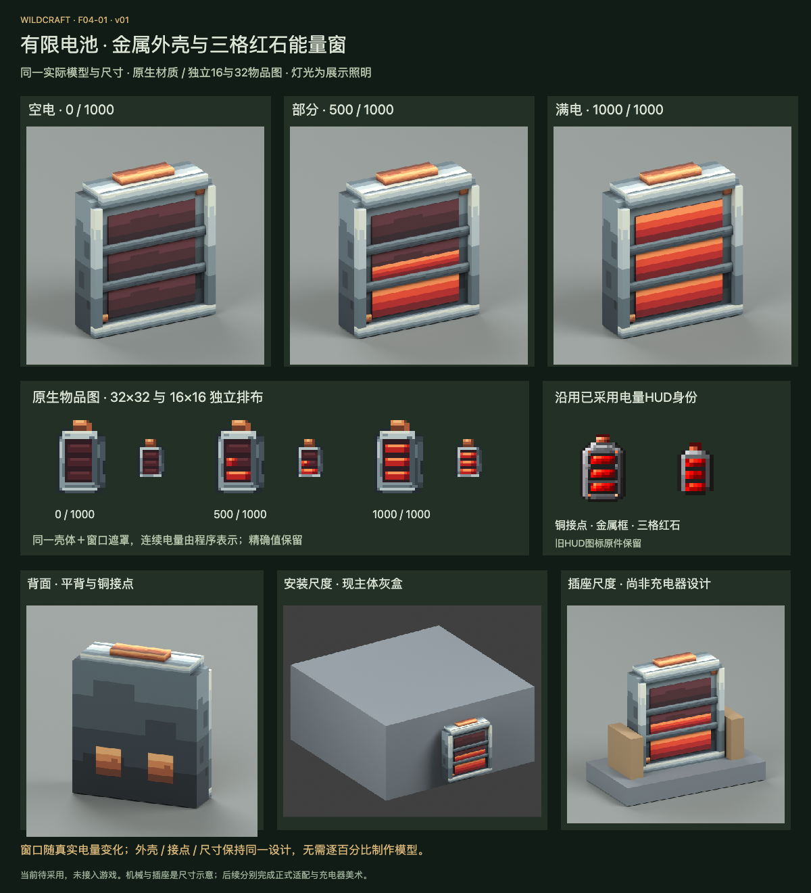

# F04-01 有限电池正式外观 · v01

2026-10-05。**状态：2026-10-05用户已采用，未接入游戏。**上一项F01-04料理锅界面已根据用户“采用，继续吧”登记采用。

本项是有限电池本体：扁平金属盒、钢色边框、顶部铜接点、背面铜接点、三格凹入式红石能量窗。延续已采用电量HUD的身份特征。空／半／满电保持相同外壳与尺寸，只有窗口填充改变；容量仍为1000，不增加无限能源、发光Shader或新材料机制。

## 文件交付

| 文件 | 用途与验证 |
| --- | --- |
| [Blender源稿](source/battery-v01.blend) | 可编辑16方盒＋3动态窗口面，32px纹理已内嵌；重开检查通过 |
| [Blockbench源稿](source/battery-v01.bbmodel) | 16静态方盒、显式UV、内嵌PNG；JSON结构与内嵌图检查通过，本轮未在Blockbench中打开 |
| [静态模型候选](exports/battery-static-model.json) | 外壳／暗窗，不含写死的电量；供后续物品／设备渲染复用 |
| [动态窗口参数](exports/battery-dynamic-windows.json) | 三格位置、填充与安装坐标变换 |
| [原生32px材质图集](exports/battery-atlas-32.png) / [Aseprite源稿](source/battery-atlas-32.aseprite) | 2层，金属、边框、铜、暗窗与红色填充共享一图集 |
| [32px物品图](exports/battery-item-32.png) / [源稿](source/battery-item-32.aseprite) | 3层原生空壳基底；用于叠加动态窗口，不固定表示满电 |
| [16px物品图](exports/battery-item-16.png) / [源稿](source/battery-item-16.aseprite) | 独立安排接点、边框和三窗；未缩小32px生成 |
| [物品窗口遮罩规范](exports/battery-item-energy-regions.json) | 从下到上填格，格内从左到右；精确值继续由原版电量条／提示显示 |
| [几何与UV](source/geometry-and-uv.json) / [材质分区](source/uv-regions.json) | 尺寸、部件命名、材质区域与安装变换 |
| [交互预览文件](review/preview.html) / [本机预览](http://127.0.0.1:8806/preview.html) | 实际几何可旋转，电量0–1000，原生16/32遮罩模拟与实际模型图 |
| [制作简报](brief.md) / [后续接入说明](integration-map.md) | 统一设计、复用与未实施的运行接入 |
| [检查说明](verification.md) / [交付清单](manifest.json) | 源稿、像素、几何、动态显示和文件证据 |

## 当前与后续范围

本轮完成电池本体、3种电量渲染、正背面及两种尺寸示意。机械主体灰盒采用现有1.4×1.4×0.65尺寸；插座是容纳参照，不是F04-03充电器正式造型。正式六节点朝向／遮挡、吸附预览与安装适配仍按后续F05-05任务完成，不以单张示意冒称全部安装已验证。

模型宽6.4、高7.36、厚1.93个模型单位（1单位=1/16方块）；厚度含背面接点的0.01单位偏移以避免共面闪烁。主体宽高保持现安装电池的0.4×0.46方块范围，不新增碰撞。物品、机械与充电器保持同一物理设计，GUI图标只是表示它的低分辨率图。

物品基底与程序遮罩尚未接入实际物品渲染；旧游戏仍使用原型和真实电量条。三种红窗预览不能当作已实现的新资源分流。后续需按真实BatteryData读取电量，保留提示中的余量／容量；不要只把满电截图替换物品贴图。

## 制作与检查

使用内置生图工具制作[造型参考](references/battery-concept-v01.png)，[完整提示词](references/imagegen-prompt.md)保留。该图未裁切／缩小为运行图；16／32图标与32px图集由Aseprite Web原生绘制，模型几何独立建立。

3份Aseprite及PNG已保存重开，逐像素符合设计数据；所有UV覆盖不透明像素，几何与内嵌纹理检查通过。Blender源稿重开并检查7个电量值；浏览器检查11电量×6方向共66组合，另查显示缩放、俯仰和实际深度像素。

此轮未修改Java、运行资源或dev.14游戏包，未进行游戏构建／实机测试。本项已依据用户“采用，开始下一项”登记采用；下一项F04-02为已采用电量HUD图标的遮罩与显示映射规范。
