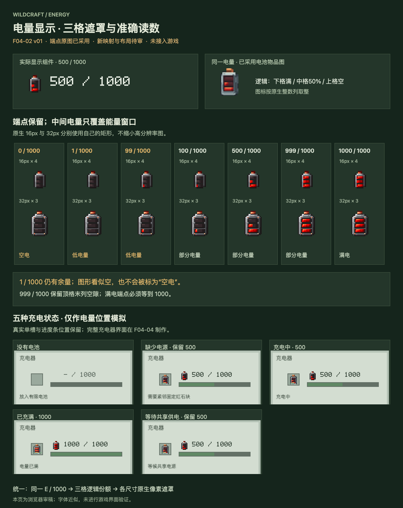

# F04-02 电量图标遮罩与读数 · v01

2026-10-05。**本项显示规范已于2026-10-05采用，未接入游戏。**原有空／满电四张图标此前已采用；上一项 F04-01 电池本体已依据用户“采用，开始下一项”登记采用。

这项补齐已采用电量图标的中间电量显示。保持金属壳、铜接点、三格红石窗口；以空电图为底，只把满电图的对应窗口像素复制进去。三格从下向上填，格内从左向右。数字显示真实余量／1000。

## 文件交付

| 内容 | 文件与用途 |
| --- | --- |
| 原生16px两端点 | [空电PNG](exports/battery-empty-16.png)、[满电PNG](exports/battery-full-16.png)；两份[空电源稿](source/battery-empty-16.aseprite)、[满电源稿](source/battery-full-16.aseprite) |
| 原生32px两端点 | [空电PNG](exports/battery-empty-32.png)、[满电PNG](exports/battery-full-32.png)；两份[空电源稿](source/battery-empty-32.aseprite)、[满电源稿](source/battery-full-32.aseprite) |
| 动态遮罩与布局参数 | [窗口矩形](exports/energy-regions.json)、[电量读数组件规范](exports/battery-readout-layout.json) |
| 可复现显示逻辑 | [审稿组件](source/battery-readout.js)，仅供本地审稿和后续接入参考，未加入游戏 |
| 交互审稿 | [本机预览](http://127.0.0.1:8807/preview.html)、[自包含预览文件](review/preview.html)：电量0–1000、尺寸16/32、整数缩放、深浅底色、五种充电状态及中英文 |
| 设计与后续接入 | [制作简报](brief.md)、[映射说明](integration-map.md)、[检查记录](verification.md)、[文件清单](manifest.json) |

四份PNG与四份Aseprite逐字节复用采用稿，均为单帧、单层索引色源稿。16px与32px使用各自的原生窗口坐标。本项没有生成新造型图、重新量化颜色或缩小32px制作16px。

## 电量阅读规则

- **0 / 1000** 是实际空电池；**没有电池** 隐藏图标，显示 **— / 1000**。
- **1–99** 以琥珀色数字提示低电量；100起恢复普通数字颜色。红石窗口保持原已采用颜色。低电量不等于空电。
- **999** 仍保留顶格最后一列空隙；1000才完整显示已采用满电图。
- 缺少固定红石源、充电中、等待共享供电都读取电池自己的实际余量；状态文字不改变图标电量。
- 16px三窗各5列，32px各9列。16px的首列在67亮起，32px在38亮起；小于这个值仍显示准确数字。图形是原生像素近似，数字是准确值。

500电量的逻辑份额是下格满、中格50%、上格空；16px中格取2/5列，32px取4/9列。新电池物品图采用自己的窗口宽度，3D模型采用连续高度；它们共用同一份额，不要求不同尺寸亮起的像素数相同。

## 接入与范围

候选组件在现176×166充电器界面的电量区：图标(54,29)、数字(74,32)；真实单槽(26,35)、进度条与状态锚点保留。最大数字“1000 / 1000”的审稿字宽65px，在右侧94px范围内。正式接入使用原版字体，此处自绘数字只用于模拟，实际字宽还需游戏验证。

充电器局部底色沿用当前原型；完整界面在F04-04制作。没有新增常驻玩家HUD、额外库存槽、新电量等级、闪烁机制或独立状态数据。容量保持1000。物品已有13px电量条及准确tooltip继续保留，充电器已有105px进度条保持原计算规则。

已通过2002个实际像素电量案例、16组尺寸／缩放／底色组合、10组场景／语言组合。源稿重开检查通过。Java、运行资源及dev.14游戏包未修改；没有执行游戏构建或实机测试。本项已依据用户“采用，开始下一项”登记采用，下一项为F04-03充电器正式模型与纹理。
