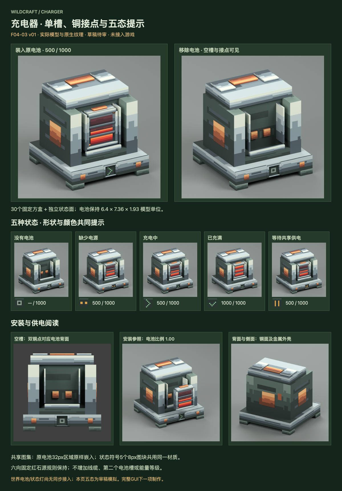

# F04-03 充电器正式模型与纹理 · v01

2026-10-05。**2026-10-05用户已采用，未接入游戏。**上一项F04-02电量遮罩与准确读数已依据用户“采用，开始下一项”登记采用。

充电器使用钢色底座与支柱、深绿灰机壳、铜接点和正面开放式单槽。电池原模型按1.00比例嵌入，两片背面铜点对应槽内接点，三格能量窗保持可见。上盖、支柱、前挡沿保护电池，但不覆盖其窗口。充电器处于一方块范围内，不改变当前完整方块碰撞。

## 文件交付

| 文件 | 用途与检查 |
| --- | --- |
| [Blender源稿](source/charger-v01.blend) | 30个固定方盒；五个状态候选面；已采用电池独立引用集合；重开与状态驱动检查通过 |
| [Blockbench源稿](source/charger-v01.bbmodel) | 充电器本体及中性状态面，原生UV、内嵌64px图集；JSON和内嵌图检查通过，未在Blockbench程序中打开 |
| [静态模型候选](exports/charger-static-model.json) | 30固定方盒+中性状态面，不烘焙任何电池；未放入运行目录 |
| [世界显示参数](exports/charger-presentation.json) | 同电池挂点、比例、三窗及五态UV；记录尚需真实状态同步的边界 |
| [原生64px图集](exports/charger-atlas-64.png) / [四层Aseprite](source/charger-atlas-64.aseprite) | 钢、机壳、铜、凹槽、通风纹理、五个8px状态图块；原电池32px区域原样嵌入 |
| [几何与UV](source/geometry-and-uv.json) / [材质分区](source/uv-regions.json) | 充电器零件、原电池引用与接点坐标 |
| [本机交互预览](http://127.0.0.1:8808/preview.html) / [自包含文件](review/preview.html) | 实际几何可转动；余量0–1000、五态切换和实际模型渲染 |
| [空槽接点](review/charger-empty-front.png) / [电池安装参照](review/charger-battery-fit-exploded.png) / [背面](review/charger-back.png) | 实际网格与UV渲染，不是概念图 |
| [制作简报](brief.md) / [接入说明](integration-map.md) / [检查记录](verification.md) / [清单](manifest.json) | 设计、复用、已验证事项与后续接入 |

## 状态阅读

| 当前真实状态 | 状态窗 | 电池表现 |
| --- | --- | --- |
| 无电池0 | 灰色空框 | 不画电池；读数无电池 |
| 缺固定红石源1 | 琥珀断线 | 显示实际电池与真实余量 |
| 充电中2 | 绿色箭头 | 显示真实余量，不提前画满 |
| 已充满3 | 绿色勾 | 同一电池，三窗满，1000 |
| 等待共享供电4 | 琥珀双竖线 | 保留电池余量，区别于缺源 |

符号形状与颜色共同表达，状态窗不闪烁、不使用额外发光Shader。电量变化仅改变原电池的红石窗；没有新增常驻HUD、能量等级或第二个电池槽。精准数字复用已采用F04-02组件，完整充电器界面在F04-04完成。

六个相邻方向的固定红石块都沿用当前供电规则；铜饰面不是限定方向的插口。当前充电器没有facing属性，候选模型固定正面+Z，不增加旋转玩法、线缆、插拔动画或碰撞形状修改。

## 复用与完成边界

电池原16方盒的几何尺寸和UV像素保持，只做固定位置平移；64图集左上角32×32逐像素等于已采用电池图集。一个图集服务机壳、五态符号和安装电池，空／部分／满电与五种状态不需要独立机身贴图或五套模型。

采用内置生图工具制作[造型参考](references/charger-concept-v01.png)，[提示词](references/imagegen-prompt.md)保留。该图没有缩小或裁切成运行纹理；图集在Aseprite Web以原生像素绘制，模型由独立几何构建。

源稿重开、内嵌纹理、接点对位、无穿插与UV检查通过；浏览器检查五态×六朝向共30组合、9电量值和3俯仰值，并读取实际窗口像素验证深度显示。Java、运行资源和dev.14包未改，未进行游戏构建或实机验证。

**五态与槽内电池是审稿模拟。当前代码只向充电菜单同步状态，没有世界电池／状态灯的客户端显示同步。**后续接入必须读取真实快照；不根据画面猜状态，不把模型审稿当作游戏功能已实现。本项已依据用户“采用，开始下一项”登记采用，下一项F04-04为充电器界面。
