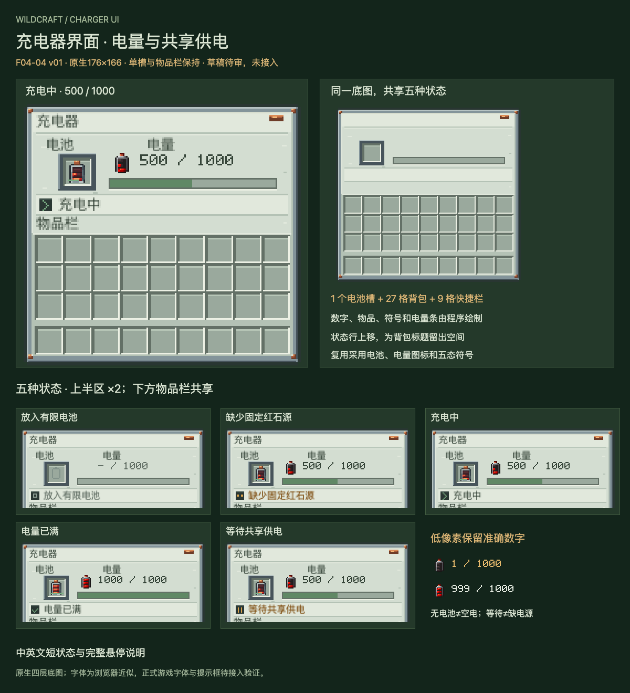

# F04-04 充电器界面 v01

2026-10-05。**2026-10-05用户已采用，未接入游戏。** F04-03 充电器模型与纹理已按用户“采用，开始下一项”登记采用。

[打开交互审稿页](http://127.0.0.1:8809/preview.html)。可切换五种状态、中英文、1—4倍显示及0—1000准确余量；鼠标移到状态行或电池上查看完整说明。网页外侧控件用于审稿。

本项采用钢色边框、铜紧固点和浅绿灰底板，与已采用电池及充电器材料一致。只新增一张原生176×166底图；电池、电量图标和五态符号均复用采用稿。数字、物品、电量条、状态文字与提示由程序绘制。

| 状态 | 界面读法 | 完整说明 |
| --- | --- | --- |
| 无电池 | 空槽轮廓、— / 1000 | 槽为空，与0电量电池区分 |
| 缺少固定红石源 | 琥珀符号与短文字；保留余量 | 需要任一相邻方向的已放置红石块；手持与红石信号不供电 |
| 充电中 | 前进符号、准确余量与电量条 | 正在接收相邻红石源供电 |
| 电量已满 | 勾形符号、1000 / 1000 | 可取走使用；无电源时仍读为满电 |
| 等待共享供电 | 暂停符号与短文字；保留余量 | 有固定红石源，正在等候共享供电 |

实际1个充电槽、27格背包和9格快捷栏坐标保持原样。状态行从原型y64上移到y60，独立留白，避开y72物品栏标题；较长说明进入悬停提示。右上铜饰是材质细节，不是按钮。

- [原生PNG底图](exports/charger-ui-176x166.png)
- [四层Aseprite源稿](source/charger-ui-176x166.aseprite)
- [布局参数](exports/charger-ui-layout.json)与[候选中英文文案](exports/charger-ui-labels-candidate.json)
- [接入规范](integration-map.md)与[验证记录](verification.md)
- [英文供电说明预览](review/charger-status-help-en.png)

已验证源稿/PNG像素一致、37格坐标、全部余量下3003次实际电量条像素绘制、10种状态/语言排布、18种提示排布和40种实际浏览器状态/语言/倍数组合。

网页字体是浏览器近似。正式Minecraft字体、游戏内悬停、物品转移与多人充电尚需后续接入验证；本轮没有修改Java、生产语言文件或dev.14游戏包。

本项已依据用户“采用，开始下一项”登记采用；排队表下一项为**F05-01：机械主体、六节点与控制板正式外观**。
