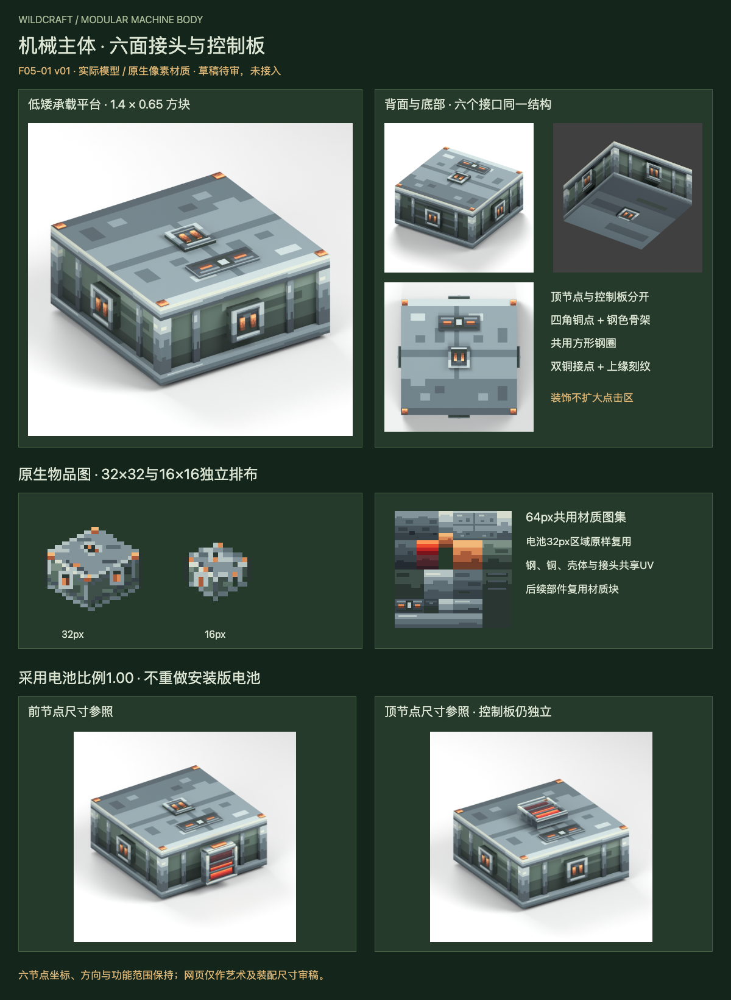

# F05-01 机械主体、六节点与控制板 v01

2026-10-05。**2026-10-05用户已采用，未接入游戏。** 前项F04-04充电器界面已根据用户“采用，开始下一项”登记采用。

[打开交互审稿页](http://127.0.0.1:8810/preview.html)，可查看正面、背面、顶面、底面，旋转实际几何，并在六个节点分别放入已采用电池作尺寸参考。网页外侧输入用于审稿，不是新增游戏界面。

主体采用低矮钢框平台、绿灰侧壳、板缝与紧凑明暗像素簇，四角铜紧固点沿用电池/充电器材料。六个中心接头使用同一套方形钢圈、暗凹面、双铜点和上缘刻纹。前上控制板与顶接头分开，全部板体落在现功能命中范围内。

本项交付：1主体模型、1可重复使用的接头模板及6个实例、1控制板、1张64px共用材质、1个物品图方向的32/16原生适配、实际渲染和接入参数。Blender源内采用电池单独放在隐藏的参考集合，主体导出不烘焙安装电池。

- [Blender可编辑源](source/machine-body-v01.blend)与[Blockbench自由模型源](source/machine-body-v01.bbmodel)
- [原生64×64图集](exports/machine-atlas-64.png)与[四层图集源稿](source/machine-atlas-64.aseprite)
- [32×32物品图](exports/machine-body-item-32.png)、[16×16物品图](exports/machine-body-item-16.png)
- [32px三层源稿](source/machine-body-item-32.aseprite)、[16px三层源稿](source/machine-body-item-16.aseprite)
- [六节点/控制板接入规范](integration-map.md)、[验证记录](verification.md)、[设计说明](brief.md)

所有原生PNG/源稿已重开确认像素一致。Blender已重开、内嵌材质和六向原电池30组朝向/电量驱动检查通过；实际浏览器42组视角/装配与30组电量渲染通过。

此轮没有修改Java、碰撞、交互或dev.14包。Blockbench文件已作结构核验，尚未在Blockbench应用中打开；六向尺寸参考不替代F05-05的完整安装/拆卸/遮挡与游戏实测。

本项已依据用户“采用，开始下一项”登记采用；下一项是**F05-03：风扇轮毂、叶片、护框与轴心**；仍按逐项审稿推进。
