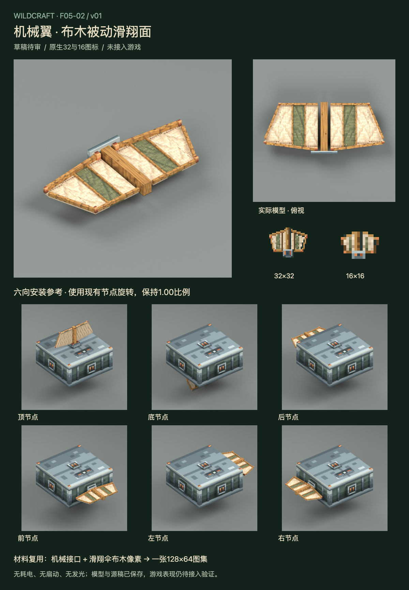

# F05-02 机械翼 v01

2026-10-05。**2026-10-05用户已采用，未接入游戏。** 前项F05-10安装预览与机械状态提示已根据用户「采用。开始下一项」登记采用；B3完成后的全件复核继续保留。

[打开交互审稿页](http://127.0.0.1:8814/preview.html)。可旋转实际网格、切换六个安装节点，查看原生32/16图标和既有滑翔起效提示的演示。

机械翼使用固定的双侧梯形布面、中央木纵梁、外围木骨架和钢铜根部接口。亚麻与橄榄布来自已采用滑翔伞，接口来自已采用机械主体。模型保持被动部件定位，无耗电、转动、展开收起或发光。

| 交付 | 内容 |
| --- | --- |
| 实际模型 | 28固定件：8布面、15木架/紧固件、5根部安装件；三组独立层级 |
| 原生图标 | 32×32与16×16各三层；每个分辨率独立布局 |
| 统一材质 | 128×64；左64机械图集原样复用，右四块32布木区域原样复用 |
| 实际渲染 | 斜视、俯视、根部、侧面、底面与六个节点装配，共11张 |
| 接入数据 | 本地顶点、显式UV、六向安装规范和被动状态约束 |
| 验证 | 原生源稿/PNG重开一致、材质逐像素复用、Blender六向顶点、网页操作/布局 |

- [Blender源稿](source/wing-v01.blend)与[Blockbench源稿](source/wing-v01.bbmodel)
- [32px源稿](source/wing-item-32.aseprite)与[PNG](exports/wing-item-32.png)
- [16px源稿](source/wing-item-16.aseprite)与[PNG](exports/wing-item-16.png)
- [图集源稿](source/wing-atlas-128x64.aseprite)与[PNG](exports/wing-atlas-128x64.png)
- [模型/UV数据](exports/wing-geometry.json)、[安装与状态规范](exports/wing-mount-and-state.json)、[接入说明](integration-map.md)、[验证记录](verification.md)

原有节点旋转使顶/底安装的翼面竖直，四侧安装的翼面水平。当前游戏按翼数量、下降状态与水平速度判定被动滑翔；本轮保留此约定，没有新增空气动力学或朝向判定。底节点会低于主体原下沿，碰撞与落地仍须游戏实测。

本轮只交付美术，未修改Java、资源目录或dev.14包。Blockbench文件经过结构检查，尚未在Blockbench应用打开；多部件组合、落地与真实游戏HUD仍待接入验证。生图产物仅作为外观参考，审稿板展示实际模型渲染。

本项已采用，下一项是 **F05-04：火箭及燃尽空壳**。

2026-10-05用户已采用本版；历史审稿板、审稿包及QA记录保留，未接入游戏。
