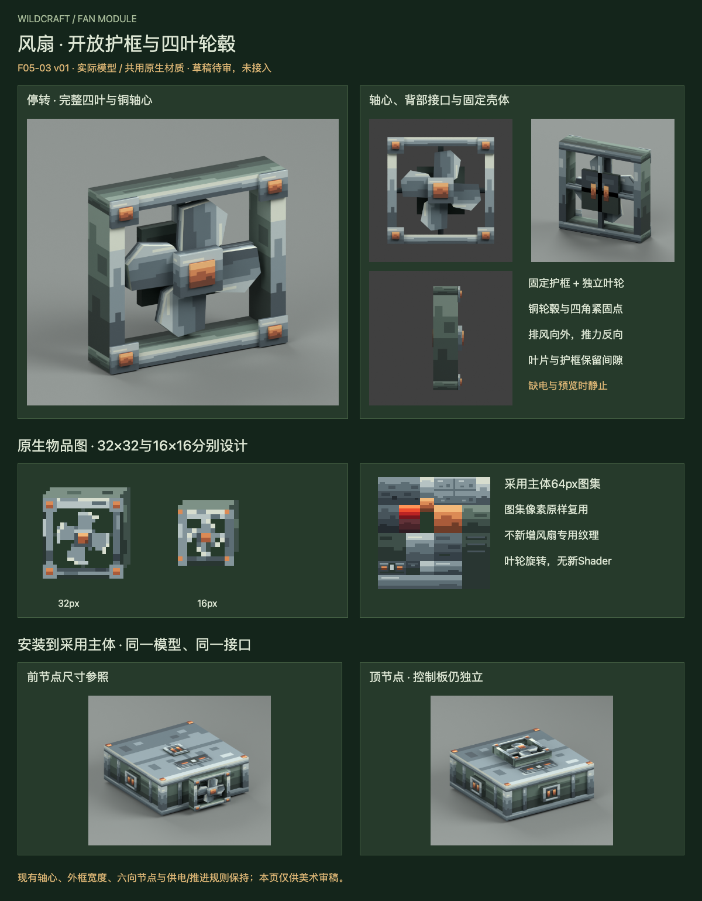

# F05-03 风扇 v01

2026-10-05。**2026-10-05用户已采用，未接入游戏。** 前项F05-01机械主体、六节点与控制板已依据用户“采用，开始下一项”登记采用。

[打开交互审稿页](http://127.0.0.1:8811/preview.html)，可切换停转/运转/安装参考、手动定格与播放，并查看六个节点的装配方向。默认停转且手动查看；网页外侧控件服务审稿，不新增游戏菜单。

风扇采用开放式方形护框、四片同向叶片、钢色轮毂和铜轴帽。固定护框与后部接口保持不动，叶轮单独绕现轴心转动。薄壳、铜紧固点与已采用主体保持一致；整张64px材质直接复用F05-01，不新增专用风扇材质。

| 交付 | 内容 |
| --- | --- |
| 实际模型 | 18固定件；4叶片+2轮毂/轴帽转动件；固定/转动分组 |
| 原生物品图 | 32×32与16×16独立布局，各三层源稿 |
| 共用材质 | 采用主体64×64 PNG与四层源稿原样拷贝，0新增图集像素 |
| 动作参数 | 轴心、旋转率、停转休止角、预览静止与方向规范 |
| 审稿 | 正/背/侧/斜视、运转定格、前/顶安装渲染、六向交互查看 |

- [Blender模型源](source/fan-v01.blend)与[Blockbench自由模型源](source/fan-v01.bbmodel)
- [32px物品图](exports/fan-item-32.png)及[三层源稿](source/fan-item-32.aseprite)
- [16px物品图](exports/fan-item-16.png)及[三层源稿](source/fan-item-16.aseprite)
- [复用64px图集](exports/shared-machine-atlas-64.png)及[原样复用源稿](source/shared-machine-atlas-64.aseprite)
- [动作参数](exports/fan-animation.json)、[接入规范](integration-map.md)、[验证记录](verification.md)

排风沿接口外向轴、推力沿相反轴；保持现0.58方块外框宽高、原安装原点和轴心。停转既可能是关机，也可能没有获得实际供电，不能仅凭安装电池或整机启用判定叶轮运转。

源稿/PNG重开一致，完整转动361组间隙、Blender实际驱动与六向轴检查通过；浏览器实际视角、动作和固定框像素检查见验证记录。此轮未改Java、推进规则、碰撞或dev.14游戏包。Blockbench文件只完成结构检查，未在应用打开；尚未完成游戏内安装/拆卸和多部件实测。

本项已登记采用，下一项是**F05-05：已采用电池的六节点安装适配**，复用现电池模型，不新增另一种电池。
