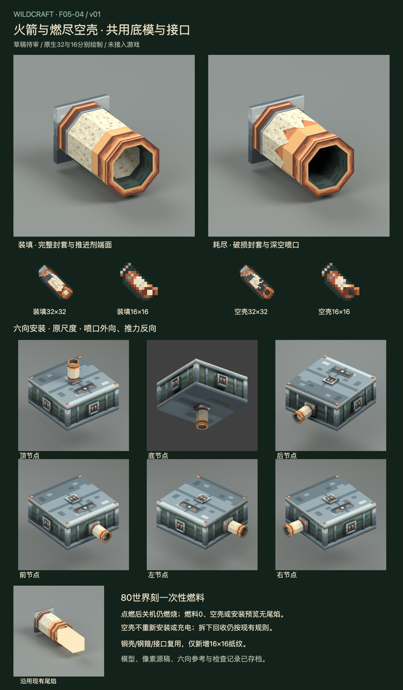

# F05-04 火箭及燃尽空壳 v01

2026-10-05。**用户已采用，未接入游戏。** 前项F05-02机械翼已根据用户「采用，开始下一项」登记采用；底装与组合仍保留为游戏接入检查。

[打开交互审稿页](http://127.0.0.1:8815/preview.html)。可切换装填、燃烧、关机仍燃烧、耗尽、末刻与透明安装预览，旋转实际网格并查看六个安装节点。

火箭是节点上的一次性推进器，采用铜壳、钢箍、纸封套和八角喷口。装填与耗尽保留相同的底模、尺度、根部安装板和触点，空壳通过封套缺口和深空喷口区分。耗尽不缩短部件、不增加另一种可安装部件。

| 交付 | 内容 |
| --- | --- |
| 可编辑模型 | 共用44件底模；装填53固定件，耗尽68固定件；两种状态在同一Blender源中 |
| 原生图标 | 装填/空壳 × 32×32/16×16，各三层独立像素稿 |
| 统一图集 | 128×64；完整保留机械64×64，仅新增原生16×16纸纹 |
| 渲染参考 | 两种斜视、两种喷口、两种侧面、根部、燃烧及两种状态各六向装配，共20张 |
| 尾焰规范 | 沿用现有方块尾焰尺寸/颜色，实际燃料>0且节点active才显示；预览无尾焰 |
| 交互审稿 | 实际几何、真实深度与透明混合、6状态×7视图、原生图标、审稿板 |

- [共用Blender源稿](source/rocket-and-spent-v01.blend)
- [装填Blockbench源](source/rocket-v01.bbmodel)与[空壳Blockbench源](source/spent-rocket-v01.bbmodel)
- [装填32px源稿](source/rocket-item-32.aseprite)与[16px源稿](source/rocket-item-16.aseprite)
- [空壳32px源稿](source/spent-rocket-item-32.aseprite)与[16px源稿](source/spent-rocket-item-16.aseprite)
- [装填32px PNG](exports/rocket-item-32.png)、[16px PNG](exports/rocket-item-16.png)、[空壳32px PNG](exports/spent-rocket-item-32.png)、[16px PNG](exports/spent-rocket-item-16.png)
- [统一图集源稿](source/rocket-atlas-128x64.aseprite)与[PNG](exports/rocket-atlas-128x64.png)
- [状态与尾焰规范](exports/rocket-state-and-flame.json)、[接入说明](integration-map.md)、[验证记录](verification.md)

当前机制为80世界刻燃料、不依赖电池、点燃后关机仍燃烧。燃尽时转换成同一个真实物品空壳；空壳无法重新安装或充电，回收规则沿用当前配方。喷口沿节点外法线，推力与其相反。

生图仅作为外观参考。审稿板、PNG和交互模型均来自实际交付网格或原生Aseprite像素稿。当前仅美术产出，未改变Java或dev.14。Blockbench源完成结构检查，尚未在Blockbench应用打开；游戏内六向安装、燃烧末刻、底装落地及多部件组合仍待接入验证。F05-10的B3全件复核尚未完成。

本项已采用，下一项是 **F05-06：弹簧**。

2026-10-05用户已采用本版；历史审稿板、审稿包与QA记录保留，未接入游戏。
