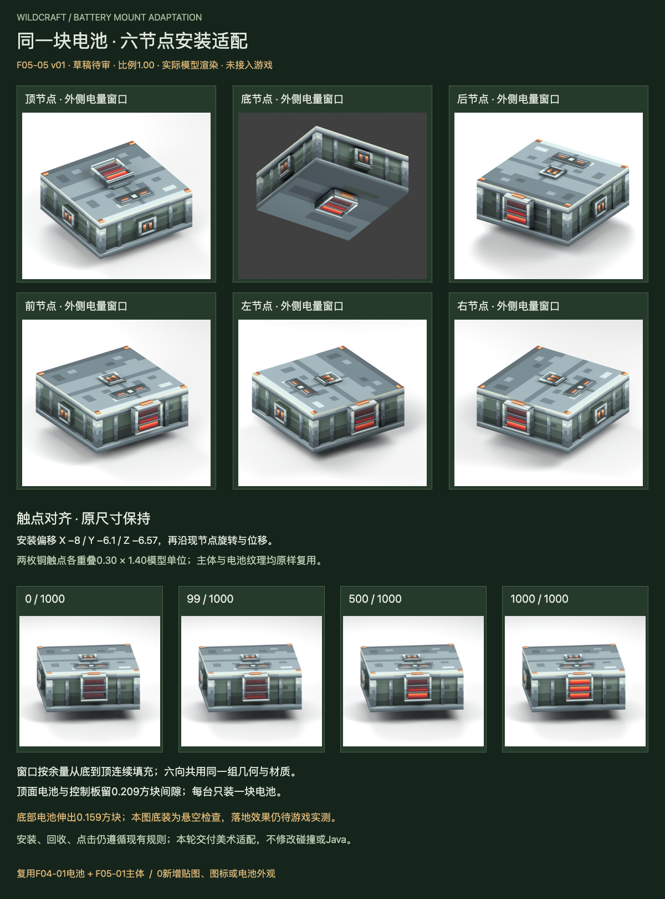

# F05-05 电池六节点安装适配 v01

2026-10-05。**2026-10-05用户已采用，未接入游戏。** 前项F05-03风扇已依据用户“采用，开始下一项”登记采用。

[打开交互审稿页](http://127.0.0.1:8812/preview.html)，可以切换六向安装、轮廓参考、拆出方向、移除后空主体、电量、视角和整机转向/倾斜。一个场景只显示一块电池，不暗示允许六电池共装。

沿用F04-01已采用电池与F05-01主体。电池模型16件、三层电量窗口、原生图标与贴图保持；比例为1.00。修正了旧尺寸参考中的居中偏移，让电池背面低位铜触点对齐接口。不新增“安装版电池”。

| 交付 | 内容 |
| --- | --- |
| 安装参数 | 六节点、坐标变换、比例、对齐偏移及安装/回收约束 |
| 可编辑装配源 | Blender主体+原电池，节点/电量/拆出间距驱动；Blockbench前节点满电静态快照 |
| 实际渲染 | 六向独立装配、空主体、拆出方向、空电/低电/满电，共12张 |
| 复用参考 | 电池32px图集、64px共用图集、原生32/16图标及原样源稿，不新增像素 |
| 验证 | 触点、六向间隙、窗口几何与UV、主体转向、风扇共存包络及输入哈希 |

- [Blender装配源](source/battery-six-node-v01.blend)与[Blockbench装配快照](source/battery-six-node-v01.bbmodel)
- [六向安装参数](exports/battery-mount-adaptation.json)、[接入规范](integration-map.md)、[验证记录](verification.md)
- [原电池32px物品图](references/F04-01-battery-item-32.png)、[16px物品图](references/F04-01-battery-item-16.png)
- [复用电池图集源](references/F04-01-battery-atlas-32.aseprite)、[共用64px图集源](references/F05-01-machine-atlas-64.aseprite)
- [安装触点示意](review/contact-alignment.svg)

顶装电池到控制板留0.20875方块间隙。底装电池伸出主体底面0.159375方块；底图采用悬空检查，不能据此认定实际落地没有穿插。接口钢圈/定位键存在最多0.003125方块的贴合嵌入，已单独登记，主体与其他节点不相交。

安装与回收继续遵循停机、空节点、至多一块电池、原ItemStack与真实电量、回收背包空间规则。可见电池外表面不扩大点击范围。此轮未改Java、运行资源、碰撞或dev.14包；未进行游戏内安装/拆卸和真实手持验证。Blockbench文件仅结构检查，未在应用打开。

本项已登记采用，下一项是**F05-10：安装预览与机械状态提示**。
