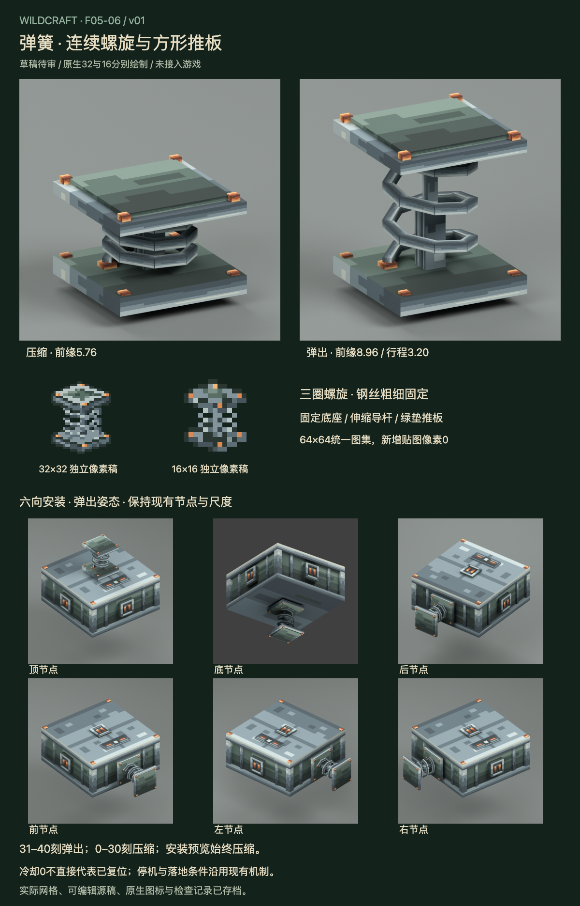

# F05-06 弹簧 v01

2026-10-05。**用户已采用，未接入游戏。** 前项F05-04火箭及燃尽空壳已根据用户「采用，开始下一项」登记采用。

[交互审稿页](http://127.0.0.1:8816/preview.html)可查看压缩、弹出、30/31世界刻边界和透明安装预览，手动调整冷却并旋转六向安装模型。页面使用实际交付网格和图集，默认静态。

钢制三圈连续八角螺旋围绕中央伸缩导杆，上下方形钢板配铜钉，推板上有暗绿接触垫。底座固定，推板和内杆移动，螺旋按端点高度变形，钢丝截面不随伸展变粗。沿用现有范围：压缩前缘5.76、弹出前缘8.96，行程3.20模型单位，即0.20方块。

| 交付 | 内容 |
| --- | --- |
| 可编辑模型 | 44网格：12固定件、8移动件、24螺旋段；Blender姿态驱动及压缩/弹出两份Blockbench源 |
| 原生物品图 | 32×32、16×16各独立三层像素稿；图标展开圈距以增强辨识 |
| 图集 | 完整复用采用机械64×64及源稿，新增生产贴图像素0 |
| 实际渲染 | 压缩/弹出斜视、正面、侧面、根部，两姿态各六向装配，共19张 |
| 姿态规范 | 31–40刻弹出，0–30刻压缩；ghost始终压缩；active不直接控制伸展 |
| 审稿页 | 7状态×7视图，手动冷却、同尺度预览、原生图标、审稿板 |

- [Blender源](source/spring-v01.blend)
- [压缩Blockbench源](source/spring-compressed-v01.bbmodel)、[弹出Blockbench源](source/spring-extended-v01.bbmodel)
- [32px Aseprite源](source/spring-item-32.aseprite)、[16px Aseprite源](source/spring-item-16.aseprite)
- [32px PNG](exports/spring-item-32.png)、[16px PNG](exports/spring-item-16.png)
- [姿态参数](exports/spring-state-and-motion.json)、[接入说明](integration-map.md)、[验证记录](verification.md)
- [生图概念参考](references/spring-concept.png)、[完整生成提示](references/imagegen-prompt.txt)

生图仅用于设计参考；交付模型、图标和审稿板来自实际网格及原生像素文件，没有把生图缩小充当原生32/16。图标以展开圈距表达弹簧身份，交互页和实际模型的压缩/弹出比例按现有机制。

冷却0不能直接认定可再次弹射；服务端还检查armed、落地、停机复位和完整能源支付。当前客户端不含armed，页面不伪造就绪提示。未新增回弹物理、持续形变、特效或游戏代码。

Blockbench文件完成结构和内嵌纹理核对，尚未在Blockbench应用打开；实际安装、底装落地、弹射、能源扣除、同步及组合仍须游戏接入验证。F05-10 B3全件复核待所有部件齐备。

本项已采用，下一项为 **F05-07：车轮**。

2026-10-05用户采用本版，历史审稿板/审稿包/QA保留。未接入游戏。
