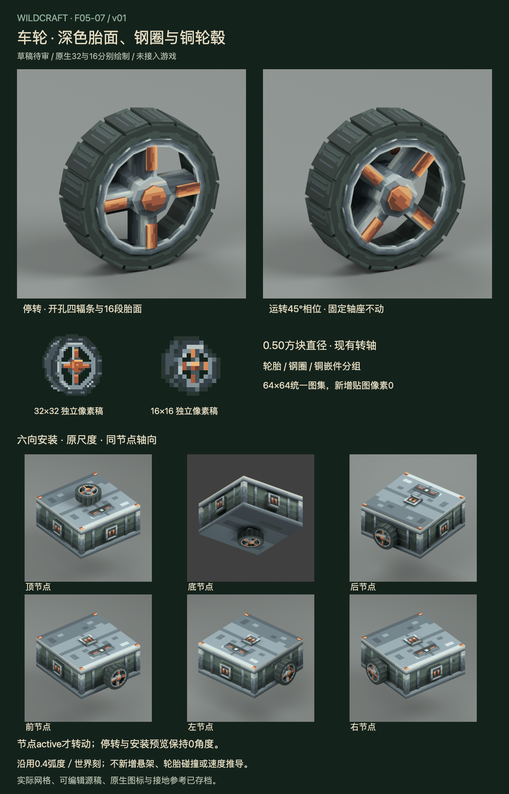

# F05-07 车轮 v01

2026-10-05。**用户已采用，未接入游戏。** 前项F05-06弹簧已根据用户「采用，开始下一项吧」登记采用。

[交互审稿页](http://127.0.0.1:8817/preview.html)可查看停转、运转相位、后退同转向参考及透明安装预览，播放/暂停转动演示，并旋转六向安装模型。页面来自实际交付网格与图集，默认静止。

车轮采用16段深色胎面、细钢圈、四根铜嵌件辐条及八角中央轮毂；辐条之间真实开孔，后方安装板与轴固定。沿用原型0.50方块直径与节点本地+Z转轴，pivot=[0,0,4]模型单位。工作时按原0.4弧度/世界刻转动，停转与ghost回到0角度。

| 交付 | 内容 |
| --- | --- |
| 可编辑模型 | 67网格：9固定件、58转动件；Blender实际驱动与Blockbench free源 |
| 原生物品图 | 32×32、16×16各独立三层Aseprite稿，10种可见色，真实透明开孔 |
| 图集 | 完整复用采用机械64×64及源稿，新增生产贴图像素0 |
| 实际渲染 | 停转斜视、前/后/侧面、45°运转相位、六向安装及接地外观，共12张 |
| 动画规范 | 节点active且非ghost才转，现有rate0.4；安装座不动，无速度推导和倒车反转 |
| 审稿页 | 6状态×7视图，手动相位、播放/暂停、同尺度显示、原生图标、审稿板 |

- [Blender源](source/wheel-v01.blend)、[Blockbench源](source/wheel-v01.bbmodel)
- [32px Aseprite源](source/wheel-item-32.aseprite)、[16px Aseprite源](source/wheel-item-16.aseprite)
- [32px PNG](exports/wheel-item-32.png)、[16px PNG](exports/wheel-item-16.png)
- [转动参数](exports/wheel-motion.json)、[接入说明](integration-map.md)、[验证记录](verification.md)
- [生图概念参考](references/wheel-concept.png)、[完整生成提示](references/imagegen-prompt.txt)

原渲染器固定轮体盒、仅转动正面标记；本版美术将同一角度应用到胎面/轮圈/轮毂整体，轴座仍固定，未改变驱动或资源规则。后退输入在当前渲染没有反向角度，沿用这一事实，不模拟里程或惯性滚动。

保持当前原型尺寸与侧节点高度后，侧轮下缘比机体底平面高约0.075方块。接地参考如实展示间隙，不假造贴地；现有动力判定读取整机onGround，未新增独立轮胎碰撞、悬架或扩大轮径。游戏接入时须核对地面与组合外观。

生图仅为方向参考。实际模型、PNG和审稿板来自网格及原生像素稿，没有把生图缩小充当32/16。Blockbench文件结构/内嵌纹理已核对，尚未在Blockbench应用打开；实际游戏装配、能源扣除、接地、同步和组合仍待接入验证。F05-10全件复核待B3部件齐备。

本项已采用，下一项为 **F05-08：稳定器**。

2026-10-05用户采用本版，历史审稿板/包/QA保留；未接入游戏。
