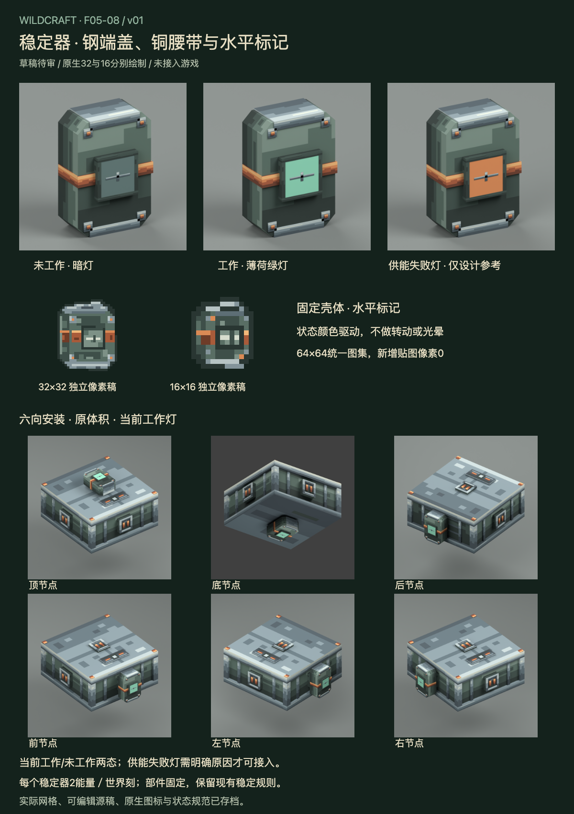

# F05-08 稳定器 v01

2026-10-05。**用户已采用，未接入游戏。** 前项F05-07车轮已根据用户「采用，开始下一项」登记采用。

[交互审稿页](http://127.0.0.1:8818/preview.html)可查看工作/未工作灯、供能失败灯设计参考、统一透明预览及六向安装。倾侧滑条在安装视图展示现有工作稳定器使整机roll归零的规则。

稳定器采用倒角暗绿壳体、钢端盖与角部支撑、铜腰带和中央方形灯框。水平标记表达平衡，与电池电量窗口区分。25个网格全部固定，没有转动陀螺、摆动、光晕或闪烁；灯面使用状态颜色，不增加贴图帧。

| 交付 | 内容 |
| --- | --- |
| 可编辑模型 | 25固定网格，含1个状态灯面；Blender三通道颜色驱动与Blockbench几何/UV源 |
| 原生物品图 | 32×32、16×16各独立三层Aseprite稿，分别13/12种可见颜色 |
| 图集 | 完整复用采用机械64×64及源稿，新增生产贴图像素0 |
| 当前状态 | 未工作607775、工作8DD5B7；不从暗灯、电池余量或整机开启推断缺电 |
| 第三色参考 | 供能失败DB8A55；只作设计参考，需明确失败原因才能接入 |
| 实际渲染 | 三色斜视、正/后/侧面、三灯面近看及六向安装，共15张 |
| 审稿页 | 7状态×7视图，倾侧规则参考、真实深度/透明预览、原生图标、审稿板 |

- [Blender源](source/stabilizer-v01.blend)、[Blockbench几何与UV源](source/stabilizer-v01.bbmodel)
- [32px Aseprite源](source/stabilizer-item-32.aseprite)、[16px Aseprite源](source/stabilizer-item-16.aseprite)
- [32px PNG](exports/stabilizer-item-32.png)、[16px PNG](exports/stabilizer-item-16.png)
- [状态规范](exports/stabilizer-state.json)、[接入说明](integration-map.md)、[验证记录](verification.md)
- [生图概念参考](references/stabilizer-concept.png)、[完整生成提示](references/imagegen-prompt.txt)

保持原型X/Y±2.88/4.16、最前沿Z4.00，背面铜触点Z0.60至0.64。主壳略收至X±2.80/Y±4.08，让钢盖与铜腰带有实际厚度，避免共面重叠。节点与尺度沿用现合同。

当前节点active才能点亮工作灯；整机working、开启或电池剩余量不能替代它。支付后电量可能为0而本刻仍active，工作灯仍保持薄荷绿。琥珀色仅供审阅外观，没有新增同步字段、缺电机制或接口。物品图使用固定识别色，不表达真实工作或电量。

生图仅为参考，模型与原生图标另行制作。Blockbench文件已核对结构及内嵌纹理，应用尚未打开；原生Blockbench显示基础灯面纹理，三态RGB需按状态规范接入材质。实际安装、供能、同步、底装和组合仍须游戏验证，F05-10全件复核待B3齐备。

本项已采用，下一项为 **F05-09：浮力装置**。

2026-10-05用户采用本版；历史审稿板、审稿包和QA保留。
