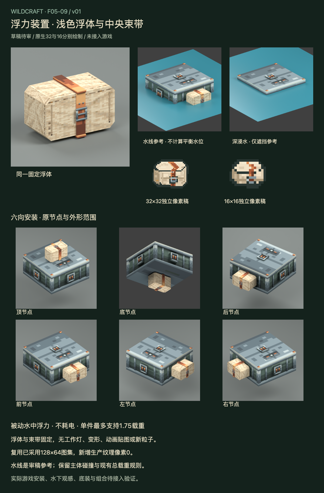

# F05-09 浮力装置 v01

2026-10-05。**用户已采用，未接入游戏。** 前项F05-08稳定器已按用户「采用，开始下一项」登记采用，原历史审稿包/QA保留。

[交互审稿页](http://127.0.0.1:8819/preview.html)提供八个场景参考及独立/六向安装视图。水面仅用于遮挡与辨识检查，不是平衡水位或浮沉模拟。

横向倒角浅色浮体、中央铜色束带、钢扣与背面暗绿安装板，沿现kind8尺寸范围。15固定网格、94外向面，没有工作灯、变形或新粒子。

| 交付 | 内容 |
| --- | --- |
| 模型 | 15固定网格，Blender与Blockbench可编辑几何/UV |
| 原生物品图 | 独立32×32与16×16，每张三层一帧Aseprite；16/11种可见颜色 |
| 图集 | 原样复用已采用机械翼128×64图集；含机械金属及浅色材质；新增生产纹理像素0 |
| 装配 | 原节点与尺度1.00；六向安装、水线与深浸水参考 |
| 实际渲染 | 斜/正/后/侧面4张、六向6张、水线2张，共12张 |
| 状态 | 水中被动浮力，不耗电，单件上限1.75；超载/空气/岩浆不提供浮力 |
| 交互审稿 | 8场景×7视图56例，原生图标、图集与实际渲染、综合板 |

- [Blender源](source/buoyancy-v01.blend)、[Blockbench源](source/buoyancy-v01.bbmodel)
- [32px Aseprite](source/buoyancy-item-32.aseprite)、[16px Aseprite](source/buoyancy-item-16.aseprite)
- [32px PNG](exports/buoyancy-item-32.png)、[16px PNG](exports/buoyancy-item-16.png)
- [状态参数](exports/buoyancy-state.json)、[接入说明](integration-map.md)、[验证记录](verification.md)
- [概念参考](references/buoyancy-concept.png)、[完整生图提示](references/imagegen-prompt.txt)

生图使用内置工具，仅作外形参考。模型另行构建，32/16通过Aseprite Web分别绘制和保存，未缩小概念图充当生产图标。图标加入侧面厚度、离散明暗、缝线和钢扣，避免大片单色。

本版保持既有总载重、六节点及主体碰撞，装饰浮体没有独立碰撞盒；底装会伸到主体碰撞盒外。实际水下呈现、地面穿插和多部件组合仍待游戏接入验收。网页状态是有明确数据的审稿快照，不冒充实时游戏状态；当前模型没有自动浮沉动画。

本版已采用，下一步完成 **F05-10：八类机械部件的统一安装预览与状态复核**，再进入 **F06-01：古代装置制造机**。

2026-10-05用户采用本版；历史审稿板、审稿包与QA保留。
