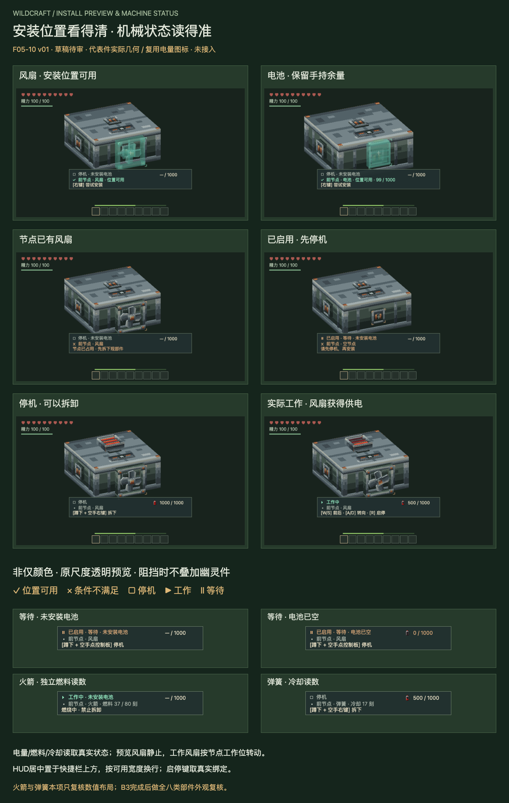

# F05-10 安装预览与机械状态提示 v01

2026-10-05。**2026-10-05用户已采用，未接入游戏。** 前项F05-05电池六节点安装适配已依据用户“采用，开始下一项”登记采用；其底装落地验证仍保留为游戏接入事项。

[打开交互审稿页](http://127.0.0.1:8813/preview.html)。可以查看18个状态场景、六个节点、中英文、三种显示尺寸、灰阶和重绑后的启停键，并播放实际工作叶轮。默认静止查看。

位置可用时用同一部件的绿色透明渲染，尺寸与安装方向保持；预览风扇静止，电池预览读取手持余量。条件不满足时不额外画幽灵件，保留原占用件，以琥珀角标、叉号与原因文字说明。位置候选不代替服务器安装结果。

HUD将状态与当前机械电量合为一行，下方显示节点/部件及操作。停机、工作、等待分别表达；未安装电池“— / 1000”与空电池“0 / 1000”区分，低电量仍可工作。燃料/冷却按所指节点真实世界刻显示，不由网页自减或回满。

| 交付 | 内容 |
| --- | --- |
| 统一规范 | 有效/无效/占用/单电池/空壳/服务器反馈、启停/实际工作、能源/燃料/冷却 |
| HUD布局 | 居中、快捷栏上方、按字体测量换行；中英、紧凑/标准/宽尺寸参考 |
| 程序化符号 | 5个9×9像素规则：勾、叉、停机、工作、等待；无需新增位图 |
| 实际几何预览 | 采用主体、风扇、电池，透明混合与深度遮挡，原尺度与UV |
| 复用源稿 | 4个电量PNG/4个Aseprite原样副本；共用64px材质与采用几何 |
| 审稿 | 18场景图片、综合审稿板、自包含交互HTML及验证记录 |

- [布局规范](exports/machine-presentation-layout.json)、[状态与接入数据](exports/machine-state-rules.json)
- [渲染与布局源](source/machine-presentation.js)、[程序化符号源](source/status-glyphs.json)、[场景源](source/review-scenarios.json)
- [复用16px空电图](references/F04-02-battery-empty-16.png)与[满电图](references/F04-02-battery-full-16.png)，对应[空电源稿](references/F04-02-battery-empty-16.aseprite)和[满电源稿](references/F04-02-battery-full-16.aseprite)
- [接入说明](integration-map.md)、[验证记录](verification.md)

代表组完成108个六向场景规则检查、108个实际下拉组合、108个中英/尺寸布局组合、24个帧缓冲透明遮挡对照与18个原生电量遮罩检查。游戏字体、玩家视角与真实服务器交互仍未验证。

本轮不新增生产模型或贴图；采用模型及图标原件未改。未改Java、碰撞、运行资源或dev.14包。火箭/弹簧在本项仅验证数值布局，外观随B3制作后补齐；八类部件完整透明/遮挡复核仍待B3，不将代表组检查当成全件完成。

本项采用后，下一项是**F05-02：机械翼（被动滑翔面）**。

本版已于2026-10-05登记用户采用；历史审稿板保留。B3全件复核仍待后续资产齐备。
