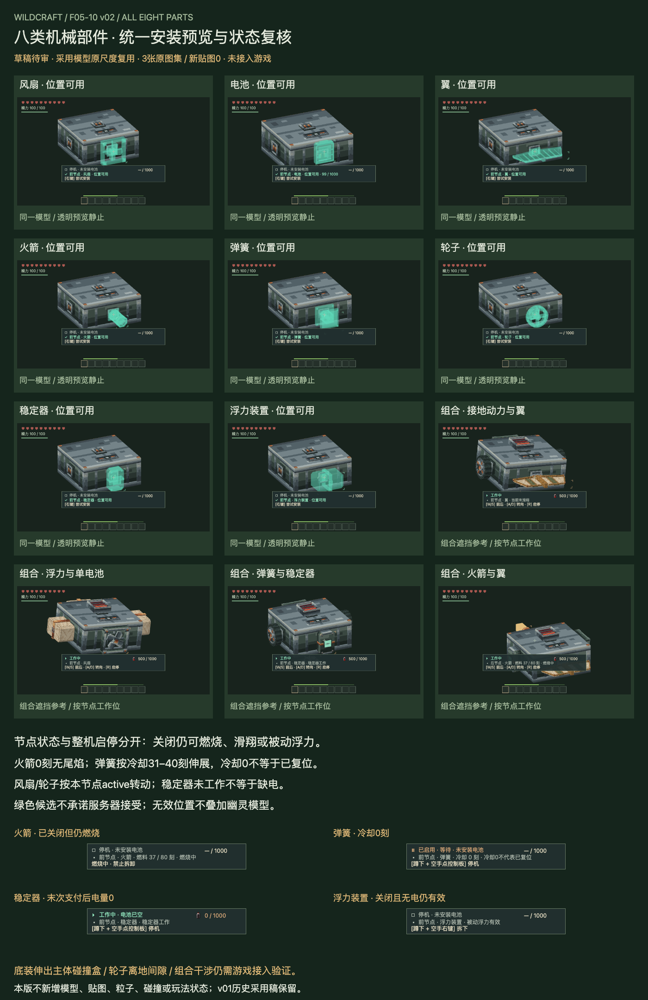

# F05-10 八类机械部件安装预览与状态复核 v02

2026-10-05。**用户已采用，未接入游戏。** 浮力装置F05-09 v01已按用户「采用，开始下一步」登记采用。F05-10 v01代表件规范和历史采用稿保留，本版补齐B3后的全件美术复核。

[交互审稿页](http://127.0.0.1:8820/preview.html)包含67个状态与装配场景，可切换六节点、斜视/节点正面/背面遮挡、中英、三种显示尺寸、灰阶和真实重绑键参考。八类部件与火箭空壳均使用已采用模型的几何、尺度和图集。播放只推进审稿角度，不消费或递减能源、燃料与冷却快照。

| 复核 | 本版结果 |
| --- | --- |
| 模型范围 | 风扇、电池、翼、火箭/空壳、弹簧、车轮、稳定器、浮力装置 |
| 六向与预览 | 48类部件/节点组合；同一原尺度模型，ghost静止/弹簧压缩、无工作灯与尾焰 |
| 状态与动作 | 末次支付0电量、火箭关机燃烧及0刻空壳、弹簧31/30/0边界、被动翼/浮力关闭仍作用 |
| HUD | 沿用采用v01布局与5个程序符号；整机启停和节点作用分开表达 |
| 资源 | 原3张图集和4张电量图复用；新增生产模型/贴图/粒子0 |
| 组合 | 接地动力+翼、浮力+单电池、弹簧+稳定器、火箭+翼4组真实几何参考 |
| 检查 | 402六向规则、402浏览器组合、402中英/尺寸布局、48实际帧缓冲深度对照 |

- [统一状态规则](exports/all-parts-state-rules.json)、[六向映射](exports/all-parts-mount-map.json)、[HUD布局](exports/machine-presentation-layout.json)
- [67场景源](source/review-scenarios.json)、[统一几何/透明渲染与HUD源](source/machine-presentation.js)
- [装配与间隙结果](review/clearance-audit.json)、[验证记录](verification.md)、[接入说明](integration-map.md)

可用位置统一绿色透明，alpha136/255，深度测试、透明不写深度、跨图集全局远到近绘制。无效位置不叠加ghost，保留真实占用部件，以原角标/叉号/文字说明原因。候选仍是本地位置判断，安装结果以服务器为准。

整机关闭不意味着所有节点无作用。翼与浮力可被动有效，已点燃火箭可继续燃烧；本版在节点行补明实际作用。稳定器工作由自己的active位决定，电量0仍可能是末次支付后的工作刻。未工作不自动推断缺电，未提供琥珀供能失败假状态。弹簧按真实冷却姿态，不把0当作已复位。

四组装配在本次参考姿态下未发现不同节点部件之间的包围盒交叠，仍不等于所有组合或真实游戏碰撞通过。八类底装均伸出主体底面；侧装车轮最低点约离主体底面0.075格。保持已采用尺寸与现有主体碰撞，这些事项留到游戏接入验证，不在审稿中自动缩小部件。

本版完成美术层的全件复核，**实际游戏安装/水下/地面碰撞/同步及真实字体未验证**。本版已采用，下一项为 **F06-01 古代装置制造机正式外观**。

2026-10-05 用户已采用 v02；历史审稿板、审稿包与 QA 保留，未接入游戏。
