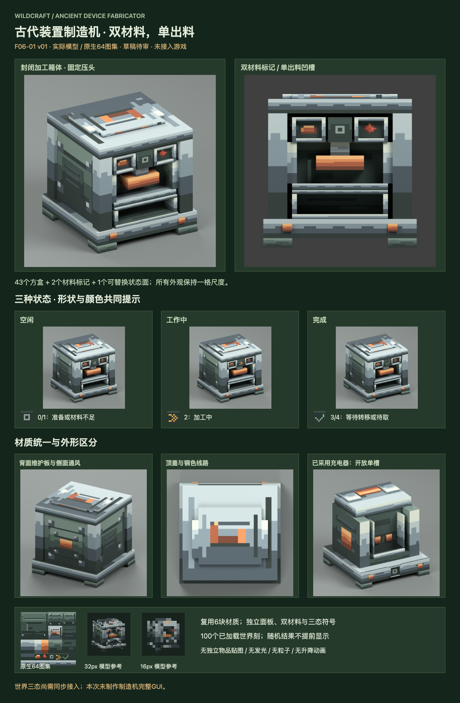

# F06-01 古代装置制造机正式外观 v01

2026-10-05。**用户已采用，未接入游戏。** 前一项 F05-10 八类机械统一复核 v02 已按用户「采用，开始下一项」登记采用，历史版本与审稿包保留。

[交互审稿页](http://127.0.0.1:8821/preview.html)可切换空闲、工作、完成，查看正面、侧面、背面及自由旋转模型。审稿页自包含，可通过本地服务打开。

封闭箱体使用钢制角柱、深绿外壳及铜色固定压头。正面上方是两种材料标记，中央是加工区，下方是单一出料凹槽；与充电器的开放电池嵌槽区分。朝正面看，铜标记在左、红石在右。顶盖采用铜色线路与钢质压板，背面设置维护板，侧面设置通风纹理。

| 交付 | 数量与用途 |
| --- | --- |
| 方块模型 | 1套固定外壳，43个方盒；Blockbench、Blender及静态Minecraft模型候选 |
| 原生纹理 | 1张64×64图集，4层Aseprite源稿；6块已采用材质逐像素复用 |
| 标记与状态 | 2个材料标记；中性方框、琥珀双箭头、绿色勾号共用同一图集 |
| 实际模型渲染 | 9张：三态、四角度、进料标记与出料凹槽近照 |
| 物品显示参考 | 32×32及16×16画布直接绘制方块几何，属于审稿参考，不是独立物品贴图 |
| 动画及特效 | 固定压头；无需额外发光、Shader或粒子资产 |

源文件：[Blockbench](source/fabricator-v01.bbmodel)、[Blender](source/fabricator-v01.blend)、[Aseprite](source/fabricator-atlas-64.aseprite)、[PNG图集](exports/fabricator-atlas-64.png)。[静态模型候选](exports/fabricator-static-model.json)、[外观状态规范](exports/fabricator-presentation.json)、[接入说明](integration-map.md)、[验证记录](verification.md)。

每批仍使用4铜锭、2红石，持续100个已加载世界刻。世界中的工作和完成表现仅为美术参考：当前代码向菜单同步progress/status，尚无对应世界客户端快照。静态模型使用中性方框；后续接入必须由权威状态选择符号。未完成随机结果、实际产物外形均未烘焙进模型。

材料标记与出料凹槽表达用途，不新增输入输出操作。现有菜单交互、固定正面+Z、完整方块碰撞及随机制造规则保持。16px仅能表达轮廓与色块，无法清晰阅读所有面板细节；实机物品显示仍需资源接入验证。

概念参考由内置生图工具生成，[完整提示词](references/imagegen-prompt.txt)与[概念图](references/fabricator-ai-concept.png)归档。实际几何和原生纹理由单独源稿制作，未将概念图缩小作为正式贴图。使用 [Aseprite Web 插件](</Users/zhou/.codex/plugins/cache/aseprite-web-local/aseprite-web/0.1.0+codex.20260917060940/skills/aseprite-web-agent/SKILL.md>)的可审计命令保存源稿与导出贴图。

本版已采用，下一项是 **F06-02 制造机完整界面**；本版外观已采用，游戏接入待完成。

2026-10-05 用户「采用，下一项」确认本版；历史审稿板、ZIP及检查保留。
