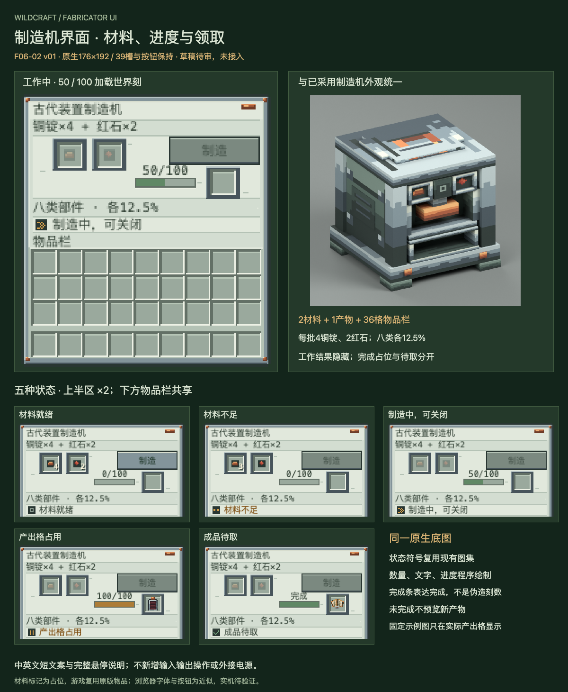

# F06-02 制造机界面 v01

2026-10-05。**用户已采用，未接入游戏。** F06-01制造机外观已按用户「采用，下一项」登记采用，模型、历史审稿板与ZIP保留。

[打开交互审稿页](http://127.0.0.1:8822/preview.html)。可切换五态、中英文、1—4倍显示，查看状态/产物范围/成本/产出格说明。在材料就绪场景点击画布内的制造按钮，再调整进度，可检查界面变化；外侧领取按钮仅为审稿演示，不连接游戏。

钢色边框、铜紧固点、浅绿灰底板延续已采用设备界面。只新增一张原生176×192底图和四层Aseprite源稿；双材料槽、单产出槽和36格背包的坐标保持。制造按钮保持(104,30)64×20，实机继续复用原版按钮。

| 状态 | 界面表现 | 结果可见性 |
| --- | --- | --- |
| 0 材料就绪 | 中性方框、制造按钮可用 | 产出格为空 |
| 1 材料不足 | 琥珀断线符号、制造按钮禁用 | 显示实际材料数量，成本要求不变 |
| 2 制造中 | 双箭头、准确加载世界刻与进度条 | 不显示本批待提交结果 |
| 3 产出格占用 | 暂停符号、满进度条及占用说明 | 只显示产出格中先前已有物品；本批结果仍隐藏 |
| 4 成品待取 | 勾号、完成满条与领取说明 | 显示实际产出格里的成品；取走后才能再次制造 |

每批4铜锭+2红石，100个已加载世界刻，八类部件各12.5%；界面说明与悬停保留这些规则。完成后服务器progress为0，状态4满条表达“已经完成”，刻数文字改为“完成/Done”，没有把0改写成100。状态来源仍是FabricatorMenu.status()，不能由客户端材料或槽位自行推断。

- [原生PNG底图](exports/fabricator-ui-176x192.png)
- [四层Aseprite源稿](source/fabricator-ui-176x192.aseprite)
- [布局与状态映射](exports/fabricator-ui-layout.json)、[候选中英文文案](exports/fabricator-ui-labels-candidate.json)
- [英文占用说明](review/blocked-help-en.png)、[接入规范](integration-map.md)、[验证记录](verification.md)

五态符号分别复用F06-01制造机图集与F04-03充电器图集；没有新增状态图标、逐帧进度贴图或特效。预览材料使用已采用8px标记占位，实机继续渲染原版铜锭与红石；预览旧电池/机械翼使用已采用16px资产，属于固定示例，不改变随机池。

已验证源稿/PNG重开一致、39槽和按钮坐标、40状态/语言/倍数组合、40悬停说明、102组实际进度条像素以及审稿按钮与领取流程。正式Minecraft字体、物品提示、容器交互与多人同步仍需接入后实机验证。本轮没有修改Java、运行语言文件或dev.14包，也没有完成状态同步接入。

本版已采用，下一项为 **F03-01 Fuse通用组合外观与挂点**。

2026-10-06 用户「采用，开始下一项」确认本版；历史审稿板、ZIP与检查保留。
