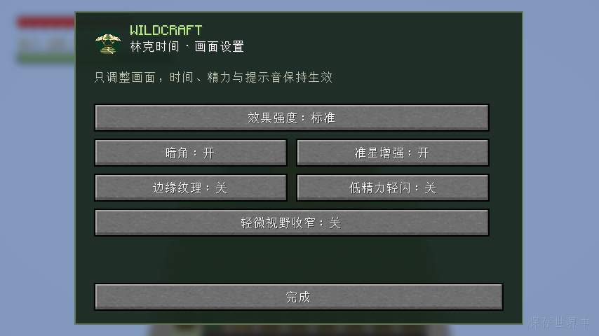

# 核心美术 v1 验证记录

2026-10-03，macOS 本机，Minecraft 26.3 / Fabric Loader 0.19.5 / Fabric API 0.161.0+26.3 / JDK 25。版本 `0.1.0-dev.7`，分支 `feature/core-art`。本轮完成核心美术接入与本机归档，未上传 GitHub，也未迁移个人存档。

## 已完成

交付的 14 个资产编号 A01、A03–A15 已接入现有玩法。运行贴图与音频沿用原件，伞网格与四肢姿态由原件转换；挂点和短过渡通过现有原版物品渲染实现。详情见 [接入规格](CORE-ART-INTEGRATION.md)。持久化格式 1、真实伞槽、原版库存与画面设置格式保持不变，没有新增生产依赖。

55 份保留原件均重新校验 SHA-256，通过。网格为 22 部件 / 132 四边形 / 264 三角形，UV 保留。Blender 烘焙必须启用两套预览模型的求值，并使用与游戏 `rotationZYX(z,y,x)` 对应的 Blender XYZ 欧拉分解；否则标准手臂偏握点、隐藏的细手臂停在初始姿态。原件未修改，这两项问题已在转换工具内修复。

## 实际执行的验证

| 检查 | 结果与证据 |
| --- | --- |
| 资源生成、正式构建与数值检查 | 通过；精力 13 示例 + 1000 边界/单调检查，计时时钟 10 检查 |
| 服务端 GameTest | 28 项通过，其中新增真实背负归属/相同备用剑/引用失效检查；XML 无失败 |
| 正式 JAR 客户端回归 | 9 类通过，包含原来的 8 类玩法/保存/网络测试和新增核心美术检查；完整 9 类回归及修正后的定点复测通过，见日志 |
| 标准/细手臂接触握点 | 第三人称烘焙与第一人称刚性握持均通过；允许误差小于 .03 方块；不是只检查方法是否执行 |
| 设置页 | 六项原有偏好仍可用；普通布局能完整显示最后一项；320×180 逻辑视口测试可滚动到最后一项，完成按钮不滚走 |
| 两个独立真实客户端 | 通过；普通帧调度、TCP 与同一冻结正式 JAR；观察者确认背负、持握互斥、开伞、丢弃、箱子、维度、重连、公开攀爬方向与放手清理 |
| 观察者隐私边界 | 附近玩家可得到公开展示附件，没有保存签名、本人精力视图或本人攀爬视图 |
| 不带测试模组的独立服务端 | 成功加载正式 dev.7 并到达 Done；使用 stop 正常保存关闭 |
| 普通客户端的真实计时 | 四种情况通过：120fps、30fps、无限/力量附魔、700ms 服务端阻塞；没有 fabric.client.gametest 调度 |
| 安装包结构 | 173 条目；ZIP CRC 通过；5 PNG / 2 OGG 与源文件原字节一致；无研究类、游戏类、AppleDouble 或个人数据 |

普通客户端在约 1.81–1.83 秒内记录 9–10 个世界刻，弓仍完整蓄力；每次释放只生成一支箭。通常服务端费用约 17.8–18.2，阻塞案例只按有效时间计费约 13.34；30fps 仍正常输入与释放。这是现有单人林克时间回归证据，不是多人局部时间已实现。

## 画面与记录

[全部证据](../development-assets/verification/core-art-v1/) 包含正式回归日志、服务端 XML、美术定点复测、普通计时、双客户端、独立服日志与截图。图片已逐张查看相关流程：第一/第三人称双手持伞、攀爬、原版背负、装备槽、低精力、多行红心、专注与设置页。

第一人称显示双臂和木架，隐藏自己的背负与原手持物品；真实物品留在库存。第三人称开伞过渡约 .3 秒进入稳定握持，拿出物品或中断立即交还原版动作。精力图集在红心下方，低精力转橙色，恢复端点轻亮；底部经验、饥饿和骑乘区域保留原合同。

## 过程中发现并处理

- 新测试首次在初始状态同步前按下跳跃键，导致未开伞；测试现在等待资格、视图和加载画面同步，并先经过释放状态。原有滑翔回归未发现玩法故障。
- Blender 欧拉顺序及隐藏细手臂求值问题通过原版 ModelPart 的实际握点检查发现，已修复；复测两种模型均通过。
- 普通矮窗口中设置页最后一项被帮助区压住；现在空间不足时省略固定帮助区，工具提示保留，小视口使用原版滚动容器。补充检查六项按钮及最后一项完整可见。
- 攀爬实际移动类型曾在发布前清零，已把清理移到同步之后；增加服务端每刻检查、真实客户端上移动作及独立观察者上移状态断言。
- 原有 `prepareP31Lab` 不兼容 Gradle 配置缓存，使用其既有 `--no-configuration-cache` 路径准备并完成双客户端验证。新 `runCoreArtClientTest` 支持配置缓存；此问题不影响正常 build 或正式安装包。

测试账号的 Realms/401 日志与本地离线账号有关；原版图形后端部分未使用 varying 的警告仍在。未见本模组着色器编译失败、缺图/缺音、Mixin 应用失败或正式服务端加载客户端类。

## 尚未验收及交付

标准/细手臂握点经过数值检查，真实游戏截图覆盖测试账号皮肤；没有逐个验收所有账号皮肤、真实披风或第三方动画/模型。低音量提示音已解码并被游戏加载，主观混音与不同扬声器响度仍由实际游玩确认。长期高延迟/丢包联机、Windows/Linux 图形游玩仍未验收。

本机 [安装包](../development-assets/wildcraft-0.1.0-dev.7+mc26.3.jar)、[源码快照](../development-assets/Wildcraft-核心美术-v1-source.zip)、校验清单和来源清单保留于开发资产目录。历史 dev.1–dev.6 及原始 SHA 清单不改写，新的核验信息在独立清单中。公开发布仍为 dev.5。
