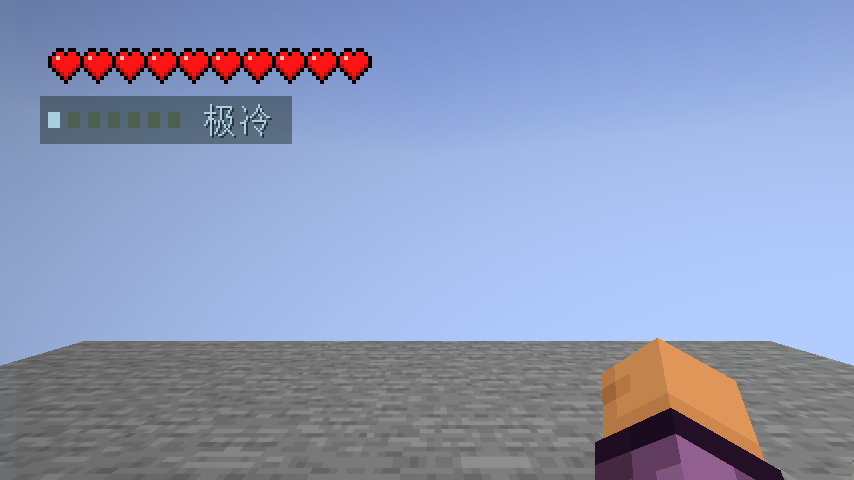
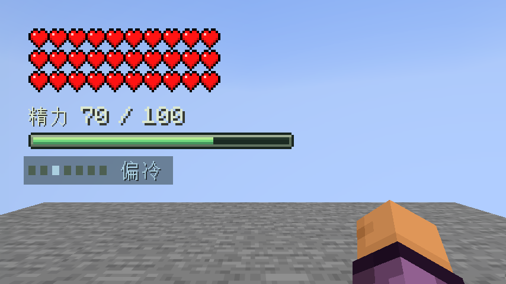

# P4A 环境温度验证记录

日期：2026-10-04，macOS 本机。Minecraft 26.3 / Loader 0.19.5 / Fabric API 0.161.0+26.3 / JDK 25。版本 `0.1.0-dev.8`，分支 `feature/ambient-temperature`。本次未上传 GitHub、未修改真实玩家存档、未增加生产依赖。

## 本阶段结果

群系、当地雨雪、浸水、受距离和遮挡限制的热源已决定本人环境读数；七档 HUD 在左上角红心/精力下方平滑显示。F8 提供独立可关闭色调；林克时间主动暂停温度色调，保留短读数。规则及参数见 [P4A-SPEC](P4A-SPEC.md)。料理与有限细雪辅助仍属 P4B，整个 P4 尚未完成。

## 实际检查

| 检查 | 实际结果 |
| --- | --- |
| 数据生成、正式构建 | 通过；使用 Wrapper，按仓库流程分开执行生成与构建 |
| 原精力/有效时钟规则 | 13 示例 + 1000 边界/单调检查、10 时钟检查通过 |
| 温度规则 | 气候顺序、水/热源上限、异常时间、卡顿截断、30/60/120fps 同等有效时间、1000 次回差扰动、7000 次有界单调插值，以及六种稳定气候从中性到正确档位通过 |
| 服务端 GameTest | 32 项通过（31 项目 + 1 原版），XML 无失败；新增四项温度检查 |
| 成品温度专项客户端 | 通过；真实服务端计算和本人连接收到的附件驱动 HUD，使用正式 JAR |
| 完整成品客户端回归 | 10 类全部通过，包含原 9 类玩法/保存/网络/核心美术及新增温度；完整运行 3m 1s |
| 无测试模组独立服务端 | 正式 dev.8 + Fabric API，127.0.0.1:25648；到达 Done，命令帮助注册正确，stop 保存退出，未加载 wildcraft-test |
| 安装包结构 | 185 条目，元数据 dev.8，ZIP CRC 正常；没有研究类、Minecraft 类或 EULA 文件；公共 Java 来源无客户端导入 |

服务端检查实际修改原版群系、天气和遮蔽：雪原更冷、丛林/沙漠更热；干燥沙漠不受全局降雨修正；露天雨雪降温、实体屋顶遮雨。热源检查点燃/熄灭营火、岩浆强度、距离、石墙和同类源不相加。

扫描检查既包含普通空场，也包含密集被遮挡岩浆候选；后者达到 16 条遮挡射线后停止且不穿墙升温。未加载位置返回零读取、零射线，仍保持区块未加载。普通采样不改变生命、精力、速度和冻结计数。

专项客户端覆盖：雪原→沙漠渐变、进水/离水、营火/熄灭、多行红心和精力、原版细雪开始冻结及皮革靴停止冻结、真实按键开伞、空中原版拉弓林克时间、保存/重载色调偏好、旁观清理、死亡/复活、下界、断开/重新进入世界。重开世界前故意注入旧冷读数，重开后仍按已保存的下界位置重新采样到热读数。

隐私检查使用一位真实集成客户端与附近的服务端模拟访客：访客实体经原版连接实际到达客户端，但访客的私人温度附件不随实体发送给观察者；并非读取另一个服务端对象来声称客户端隔离。另有双模拟玩家独立值、4 字节有界编码、非持久化及原版玩家保存/读取检查。此项不等于本阶段新增了两个独立图形客户端验收。

## 开销与同步范围

本机空场探针 100 次采样耗时 **8.624167ms**，读取 27200 个已加载方块；仅代表该测试场景、该次 JIT 和硬件，不是大型多人服容量保证。10 世界刻错峰采样，目标量化到 0.01，只在变化时发布；最多 729 方块候选位置/16 射线。20 TPS 通常每 0.5 秒，Focus 5 TPS 时每 2 秒；HUD 平滑按帧有效时间运行。

未验收长期大服、高延迟/丢包、全部第三方群系/温度模组、Windows/Linux 图形游玩或人工主观手感。未知群系采用中性基础回退；密集遮挡下可能忽略较弱可见热源。没有完整热传导、湿度计时或风场模拟。

## 发现并处理的问题

- 群系 0.8F 与双精度边界比较造成温带被误归为偏暖；纯规则检查发现并改用浮点阈值。
- 原雪原目标 -2.6 没跨过带回差的极冷边界；改为 -2.8，并新增各类气候从中性实际收敛到预期档位的检查。
- GameTest 场景上方有透光但挡雨方块；不能把它当露天。测试现在明确清出实际降水路径再加屋顶，并恢复所有改动。
- 首次开伞测试站在自建平台上；改为等待真实空中资格，未改滑翔规则。原版复活会选自建高平台，因此复活检查先明确中性出生区域，避免假定出生高度。
- 将 `runDatagen build` 放在同一次调用会触发现有 `sourcesJar` 生成资源依赖检查。按 README 分成两次调用成功，本阶段没有扩大构建重构。





## 证据与重现

当前证据目录为 [development-assets/verification/p4a](../development-assets/verification/p4a/)。历史失败尝试仅保留在本机归档，不冒充最终验证。原有里程碑 JAR、源码、美术源文件和验收均保留。

```sh
./dev.sh runDatagen
./dev.sh --no-configuration-cache build gameTestJar
# 操作者已阅读并接受 Minecraft EULA 后再用参数
./dev.sh -PacceptMinecraftEula=true --no-configuration-cache runTemperatureClientTest
./dev.sh -PacceptMinecraftEula=true --no-configuration-cache runPackagedClientTest
```

普通 `test NO-SOURCE` 不算测试通过。真实图形测试通过不替代人工体验或长期多人。
