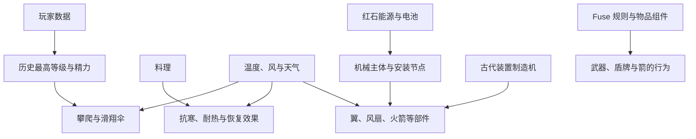

建议把 Wildcraft 定为：**以 Minecraft Java Edition + Fabric 为基础、优先在 macOS 开发和测试、从第一天兼顾单人与联机的系统型 Mod。**  
开发顺序以“探索能力”先形成可玩闭环，再接入料理、能源和机械。**第一个可运行版本只验证工程；第一个可玩版本完成“历史最高经验等级 → 精力 → 攀爬 → 滑翔伞”。** 完整范围继续覆盖你列出的全部系统。  
本轮已读取原对话、检查本地环境，并通过浏览器核实官方资料。以下是推荐方案；玩法中尚未确定的数值与交互，会明确作为建议，不当作既定设计。  
**一、版本策略：首个目标采用 Minecraft 26.3，先固定一个版本。**  
截至本次核实的 **2026 年 10 月 2 日**，Fabric 官方已经发布 Minecraft 26.3 的支持说明，官方项目模板也已经切到 26.3。原对话中的这个版本号有依据。++[Fabric 26.3 公告](https://fabricmc.net/2026/09/15/263.html)++、++[官方项目模板](https://github.com/FabricMC/fabric-example-mod/tree/26.3)++  
推荐搭建时使用下面这组**待首次构建验证的固定版本**：  

| 项目            | 推荐起始版本              | 处理原则                  |
| ------------- | ------------------- | --------------------- |
| Minecraft     | 26.3                | 第一条开发线只支持这个精确版本       |
| Java / JDK    | 25，Apple Silicon 架构 | 编译、Gradle 与开发运行环境保持一致 |
| Fabric Loader | 0.19.5              | 固定版本                  |
| Fabric API    | 0.161.0+26.3        | 使用明确对应 26.3 的构件       |
| Fabric Loom   | 1.18.2 正式版候选        | 避免使用浮动的开发快照           |
| Gradle        | 9.7.1，由 Wrapper 管理  | 不依赖电脑全局安装的 Gradle     |
| 游戏代码命名        | 26.3 官方未混淆名称        | 跟随该版本模板，不混用旧版 Yarn 教程 |
  
这里有一处需要区分：官方当前模板使用 Loom 1.18-SNAPSHOT，并配有 Gradle 9.7.1；官方 Maven 已列出 Loom 1.18.2 正式版。因此，我建议把模板中的快照替换为固定正式版，随后用第一阶段实际构建验证这一组合。**目前还不能把它称作“已在你的 Mac 上验证通过”。** ++[模板版本配置](https://github.com/FabricMC/fabric-example-mod/blob/26.3/gradle.properties)++、++[Java 编译要求](https://github.com/FabricMC/fabric-example-mod/blob/26.3/build.gradle)++、++[Gradle Wrapper 配置](https://github.com/FabricMC/fabric-example-mod/blob/26.3/gradle/wrapper/gradle-wrapper.properties)++、++[Loom 官方版本记录](https://maven.fabricmc.net/net/fabricmc/fabric-loom/maven-metadata.xml)++  
版本维护采用以下规则：  
* **不随每次 Minecraft 更新立即迁移。** 完成一个里程碑后再评估升级。  
* 新版本先进入独立升级分支，通过启动、存档、移动、渲染和联机回归后再合并。  
* 不在早期同时维护 Fabric、NeoForge，以及多个 Minecraft 版本。  
* 只有关键依赖或已验证的引擎问题阻碍开发时，才重新选择游戏基线；不为了使用旧教程而降级。  
* 官方开发文档当前主要标注 **26.2**，可参考设计方法，具体方法名和接口必须以 26.3 依赖源码为准。++[Fabric 开发文档](https://docs.fabricmc.net/develop/)++  
**二、开发环境：先把 Mac 上的一整条运行链打通。**  
本地检查结果是：当前目录尚无项目代码；电脑为 **arm64 Mac**；Git 可用；系统的 Java 检测尚未找到已注册的 Java 运行环境。这不排除某个应用自带 Java，但它还不能直接作为已配置好的开发 JDK。  

| 工具或环境  | 推荐方案                          | 完成标志                            |
| ------ | ----------------------------- | ------------------------------- |
| JDK    | Adoptium Temurin 25，aarch64   | Java、Java 编译器和 Gradle 都使用预期 JDK |
| IDE    | IntelliJ IDEA，使用免费功能即可起步      | 正确导入 Gradle 项目，能设置断点、启动客户端      |
| 构建工具   | 项目自带 Gradle Wrapper           | 换一份干净项目副本也能构建                   |
| 游戏开发实例 | Loom 提供的开发客户端                 | 与日常游玩实例分开                       |
| 成品验证实例 | 独立 Minecraft 26.3 + Fabric 配置 | 能直接安装构建出的 .jar                  |
| 服务端验证  | 本机独立 Fabric 服务端               | 不依赖客户端界面也能加载 Mod                |
| 资源制作   | Blockbench + 像素绘图工具           | 模型、贴图和源文件有固定归档位置                |
  
Fabric 官方推荐 IntelliJ IDEA，也支持 VS Code；macOS Java 指南明确区分 Apple Silicon 的 aarch64 安装包。++[开发环境指南](https://docs.fabricmc.net/develop/getting-started/setting-up)++、++[macOS Java 安装指南](https://docs.fabricmc.net/players/installing-java/macos)++  
主要游戏测试放在这台 Mac 上。后续如需扩大兼容性，再增加 Windows 或 Linux 客户端验证。  
**三、项目结构：一个 Mod、一个构建项目，内部按玩法系统分包。**  
初期不拆成多个独立 Mod，也不建立复杂的多项目架构。采用官方模板的 **公共代码与客户端代码分离**方式；只有实际需要时才增加具体模块文件。  
建议结构如下，这是目录规划，尚未创建：  
```
wildcraft/
├── build.gradle
├── settings.gradle
├── gradle.properties
├── gradle/wrapper/
├── gradlew
├── gradlew.bat
├── src/
│   ├── main/
│   │   ├── java/<basePackage>/wildcraft/
│   │   │   ├── Wildcraft
│   │   │   ├── registry/       物品、方块、实体、组件注册
│   │   │   ├── player/         历史等级、精力、玩家状态
│   │   │   ├── traversal/      攀爬、滑翔与移动状态
│   │   │   ├── cooking/        料理规则、成品和效果
│   │   │   ├── environment/    温度、风与天气影响
│   │   │   ├── fuse/           融合规则、数据和行为
│   │   │   ├── energy/         电量、充电、供电
│   │   │   ├── machinery/      机械主体、节点与部件
│   │   │   ├── fabrication/    古代装置制造机
│   │   │   ├── network/        通信消息与校验
│   │   │   └── command/        开发调试命令
│   │   ├── resources/
│   │   │   ├── fabric.mod.json
│   │   │   ├── assets/wildcraft/
│   │   │   └── data/wildcraft/
│   │   └── generated/         自动生成的资源
│   ├── client/
│   │   └── java/<basePackage>/wildcraft/
│   │       ├── WildcraftClient
│   │       ├── input/          按键与输入
│   │       ├── hud/            精力、温度、电量显示
│   │       ├── screen/         料理与制造界面
│   │       ├── render/         模型、部件与融合外观
│   │       └── datagen/        资源生成入口
│   ├── test/                  计算、规则和数据编码测试
│   └── gametest/              游戏内自动化测试
├── art/source/                Blockbench 与贴图源文件
├── docs/                      设计、验收、版本决策
└── .github/workflows/         后续持续集成配置
```
模块之间按明确方向连接：  
```

```
例如，攀爬调用精力系统扣除精力；精力系统不需要知道料理锅或风扇的实现。避免一个总管理器承担所有玩法。  
**四、客户端与服务端边界：游戏结果由服务端决定。**  
即使是单人游戏，也存在逻辑服务端，因此这条边界应当从第一个玩法系统开始遵守。++[Fabric 网络指南](https://docs.fabricmc.net/develop/networking)++  

| 客户端负责           | 服务端负责               |
| --------------- | ------------------- |
| 读取攀爬、开伞、安装部件等操作 | 判断操作是否允许执行          |
| 显示精力、温度、电量      | 计算并保存这些状态           |
| 安装位置预览、操作提示     | 校验距离、节点、物品数量与占用情况   |
| 模型、动画、声音、粒子     | 伤害、消耗、产出、部件安装与拆卸    |
| 移动预测与画面平滑       | 移动状态授权、速度限制、碰撞与位置校正 |
| 展示融合结果          | 校验材料、消耗材料、写入融合数据    |
  
通信只传必要信息。例如客户端发送“请求在这个节点安装手上的风扇”，服务端重新检查物品、距离与节点，不接受客户端直接上报“已安装完成”。  
需要特别处理：  
* 精力、电量变化采用适当频率同步，避免每帧广播。  
* 私有玩家数据发给本人；机械外观和运行状态发给附近正在观察的玩家。  
* 登入、重生、切换维度和重新进入观察范围时补发完整状态。  
* 移动沿用原版移动链，添加预测与校正，避免简单地反复修改位置造成回弹。  
* 公共代码不得直接引用客户端渲染类；独立服务端启动是每个里程碑的检查项。  
**五、数据保存：使用游戏与 Fabric 的现有机制，不增加数据库。**  
Fabric Data Attachments 可保存玩家等对象的附加数据，并支持同步及死亡后复制；物品自身的数据使用 Data Components；世界级状态使用 Saved Data。++[Data Attachments](https://docs.fabricmc.net/develop/serialization/data-attachments)++、++[物品 Data Components](https://docs.fabricmc.net/develop/items/custom-data-components)++、++[Saved Data](https://docs.fabricmc.net/develop/serialization/saved-data)++  

| 数据           | 保存方式               | 生命周期建议               |
| ------------ | ------------------ | -------------------- |
| 历史最高经验等级     | 玩家持久化 Attachment   | 同一存档、同一玩家长期保留；死亡不降低  |
| 当前精力、恢复等待时间  | 独立玩家状态             | 重连不额外回满；死亡按明确的重生规则处理 |
| 精力上限         | 从历史等级和效果计算         | 不重复保存一个容易过期的最终值      |
| 攀爬、开伞状态      | 运行时状态              | 重生或重新连接后重新校验，不恢复非法状态 |
| 料理成品         | 物品 Data Components | 保存效果种类、强度、时长等必要信息    |
| 抗寒、耐热等持续效果   | 优先利用游戏效果机制         | 明确叠加、覆盖、死亡和退出规则      |
| 电池电量         | 电池物品组件或已安装部件状态     | 安装、拆下、掉落后保持同一份电量     |
| Fuse 内容      | 宿主物品上的融合组件         | 保存材料信息、规则版本及必要状态     |
| 固定设备         | Block Entity 数据    | 随区块保存                |
| 移动机械         | 自定义实体数据            | 保存主体、部件、局部位置、电量与运行状态 |
| 世界级规则、必要环境状态 | Saved Data         | 与世界绑定，不跨存档共享         |
  
历史等级建议遵守这个明确例子：  
玩家曾达到 30 级，附魔后降到 5 级，历史记录仍是 30，基础精力上限仍按 30 计算。  
另有三个必须提前说明的边界：  
* 给旧世界首次安装 Mod 时，只能从玩家**当前等级**初始化；原版没有记录的过去峰值无法自动还原。  
* 精力成长曲线先独立为可调整规则。线性增长、递减收益和上限数值属于平衡决策，不在搭建项目时锁死。  
* 存档数据带格式版本；字段升级保留读取旧版本的路径。回退版本时恢复配套世界备份，不能假设换回旧 .jar 就能还原已升级数据。  
**六、最容易导致返工的三个系统，需要先验证技术边界。**  
**机械推荐采用“一个机械主体＋有限安装节点＋部件功能”的实现。**  
玩家通过普通放置、对准节点安装、工具拆卸完成组合。主体承载位置、速度和整体碰撞；部件提供推力、耗电、稳定或浮升作用。部件的视觉转动与其功能计算可以分开。  
对于移动结构，推荐先支持尺寸和部件数受限的玩家组合体。若后续允许把方块结构收纳为移动机械，需要明确支持的普通方块集合，并单独处理带库存的方块。  
这条方案允许玩家自由组合，但不会自动承诺任意原版方块实体、任意关节和精确刚体碰撞。自由动态连接、大型物理框架属于已暂缓的复杂机械方向。  
**能源必须分清“控制信号”和“可消耗电量”。**  
建议规则为：  
* 红石信号控制开关或运行强度，不能自动视作电量。  
* 固定红石块能源可以持续供能，但输出速率有限。  
* 固定充电器给电池充电；移动机械使用有限电池。  
* 红石块随机械移动时，不能继续被识别为固定无限能源。  
* 电量只在实际转移或运行时变化；拆卸、丢出、重连和区块重载都不能复制电量。  
这样固定无限能源与移动有限能源可以同时成立。  
**Fuse 的“任意物品”先定义为研究目标，并拆成三个层次。**  

| 层次         | 目标                     | 成功标准             |
| ---------- | ---------------------- | ---------------- |
| 明确规则的 Fuse | 已支持的材料与武器、盾牌、箭组合       | 效果、消耗、耐久和外观均可测试  |
| 按物品标签归类    | 燃烧、弹性等材料类别采用通用规则       | 新增材料不需要复制一整套实现   |
| 任意材料研究     | 未知物品也能作为材料，获得基础效果或通用外观 | 可保存、可同步、不会破坏物品数据 |
  
“能够读取一个物品”并不意味着能够自动理解它的一切功能。容器、嵌套物品、已有 Fuse 的物品、第三方复杂组件，以及自定义渲染都需要专项验证。  
推荐先在原宿主物品上添加融合组件，避免为每种组合注册新物品。外观先采用基础模型与材料表现的组合，再研究更完整的动态模型。  
**七、开发路线按以下阶段推进，每一阶段都留下可运行版本。**  

| 阶段 | 交付内容 | 主要验收标准 |
| ------------- | -------------------------------- | ------------------------------------------------- |
| P0：工程骨架 | Fabric 项目、公共/客户端入口、一个测试物品、构建流程 | Mac 客户端进世界；独立服务端启动；测试物品可获得且显示正常；成品 .jar 在独立实例加载成功 |
| R0：高风险技术验证 | 小范围验证移动机械、节点安装、复杂物品组件保存及 Fuse 渲染 | 给出可行边界、问题和推荐方案；实验代码保持隔离，不把未经验证的做法带入主线 |
| P1：玩家数据与精力 | 历史最高等级、成长函数、精力消耗恢复、HUD、调试入口 | 升级提升上限；降级和死亡不降低历史峰值；重连不刷精力；两个玩家状态独立 |
| P2：攀爬 | 可攀爬表面、进入退出、消耗、耗尽、顶部离开 | 墙角、顶部、障碍、水中和受击等情况按规则处理；不能无限攀爬或穿墙；联机不持续回弹 |
| P3：滑翔伞 | 开伞收伞、下落控制、转向、精力消耗、落地处理 | 空中切换正常；耗尽正确退出；死亡和切维度不遗留状态；跌落伤害规则一致 |
| P4：料理与温度 | 原版食材、最小烹饪流程、料理效果、冷热环境与适应 | 原料和产出正确；效果叠加有规则；抗寒耐热确实影响环境结果；退出重进不刷新持续时间 |
| P5：红石能源与电池 | 控制信号、固定能源、充电器、有限电池、电量显示 | 充放电有速率限制；能量转移数量正确；拆装不回满；移动状态无法使用固定无限供电 |
| P6：机械主体与安装回收 | 主体、安装节点、朝向、风扇和电池、运行与拆卸 | 完成“组装→供电→移动→停止→拆卸→再安装”；库存满、重复点击、多人操作不重复掉落 |
| P7：补齐全部机械部件 | 翼、火箭、弹簧、轮子、稳定器、浮力装置 | 每个部件能独立工作；组合后能量、方向、载重与碰撞规则一致；区块重载保留状态 |
| P8：古代装置制造机 | 投入原版资源、制造过程、部件产出、界面 | 输入只扣一次，输出只发一次；满库存和中途离开可恢复；重开界面不能重抽结果 |
| P9：正式 Fuse 系统 | 基础融合、标签规则、武器/盾/箭适配、名称与外观 | 保存和联机一致；处理耐久、附魔、维修与拆分；不因组合数量产生海量注册物品 |
| P10：风与天气互动 | 自定义简化风场、天气对滑翔/机械/温度的影响 | 同一位置的客户端得到一致结果；载入世界不突变；影响幅度可控且可调试 |
| P11：整合与发布准备 | 平衡、性能、兼容性、安装说明、变更记录 | 完整生存循环可玩；旧存档升级通过；多人长时间运行无明显状态漂移、复制漏洞或持续报错 |
  
其中：  
* **P0 完成：工程可运行。**  
* **P3 完成：首个可玩探索版本。**  
* **P8 完成：探索、料理、能源与机械形成较完整循环。**  
* **P11 完成：当前确定范围具备正式版本候选条件。**  
* 任意物品 Fuse 的研究结果单独报告；不能把实验成功的一小部分描述成全面兼容。  
P7 中各机械部件的职责建议保持清晰：  

| 部件   | 第一版职责                |
| ---- | -------------------- |
| 翼    | 利用速度与姿态提供滑翔能力，具有载重影响 |
| 风扇   | 按安装方向提供持续推力并消耗电量     |
| 火箭   | 在有限时间或次数内提供强推力       |
| 电池   | 储存有限电量并向其他部件供能       |
| 弹簧   | 触发一次弹射，具有复位或冷却规则     |
| 轮子   | 提供接地驱动、转向及简单坡面处理     |
| 稳定器  | 在有限纠正能力内调整姿态         |
| 浮力装置 | 提供有载重和工作条件限制的浮升作用    |
  
火箭是否一次性消耗、浮力装置适用于空气还是水、安装工具的具体形式，需要在对应阶段的玩法规格中定稿；这些选择不阻塞 P0。  
古代装置制造机可沿用原对话里的“投入红石等资源、随机获得部件”方向。随机结果应在服务端确定并保存，同时明确产出池和权重。  
**八、测试与调试要跟随功能推进，不能只检查“能不能启动”。**  
每次功能开发遵循：  
定义可观察行为 → 实现一个完整流程 → 测试规则 → 游戏中操作 → 验证服务端 → 检查存档与日志 → 合并。  
测试分成三类：  

| 测试层次         | 适合验证的内容                        |
| ------------ | ------------------------------ |
| 普通计算与编码测试    | 精力公式、料理计算、电量转移、Fuse 分类、数据保存与读取 |
| 游戏内 GameTest | 方块和实体行为、库存扣除、设备状态、死亡重生、区块加载    |
| 手动体验与联机测试    | 攀爬和滑翔手感、机械操控、HUD、模型、预测与回弹      |
  
Fabric 官方提供 Loader JUnit，以及服务端和客户端游戏测试支持，可按需启用。++[自动化测试指南](https://docs.fabricmc.net/develop/automatic-testing)++  
测试场景至少包括：  
* 单人创造测试世界和生存测试世界。  
* 本机独立服务端；关键联机流程使用两个客户端。  
* 死亡、重连、切维度、重启服务端、区块卸载与重载。  
* 背包满、物品用尽、重复操作、两人同时操作设备。  
* 游戏暂停、低帧率、存在网络延迟时的精力与移动表现。  
* 一份旧版测试存档升级到新版。  
调试工具逐步提供查看玩家状态、设置测试电量、观察安装节点和碰撞边界、强制测试风况等能力。修改状态的命令限制为开发环境或有权限的管理员使用。  
性能方面先建立同一机器、同一场景的基线，再增加机械数量。重点观察服务器每刻耗时、客户端帧率、实体数量和网络流量；机械数量与尺寸上限由测量结果决定。  
**九、Git 与版本策略采用简单主线，存档版本另行管理。**  
* main 始终保持可以构建、可以启动。  
* 日常功能使用短分支，例如 feat/stamina、feat/climbing。  
* 风险实验使用 spike/mechanical-body、spike/arbitrary-fuse。  
* Minecraft 升级使用独立分支，避免与玩法改动混在一起。  
* 每个合并单元写清改变的行为与实际验证结果。  
* 不提交开发世界、日志、构建缓存和个人 IDE 状态；提交 Wrapper、源资源与必要构建配置。  
建议版本节奏：  

| 版本            | 含义           |
| ------------- | ------------ |
| 0.1.0-dev.1   | 工程骨架通过验收     |
| 0.2.0-alpha.1 | 精力、攀爬、滑翔形成闭环 |
| 后续 0.x        | 逐步加入其他系统     |
| 0.9.x-beta    | 全范围整合与修复     |
| 1.0.0         | 当前完整范围达到验收要求 |
  
发行文件或标签带 Minecraft 目标版本，例如 wildcraft-0.2.0-alpha.1+mc26.3。Mod 版本、Minecraft 版本和存档格式版本分别记录。  
持续集成先负责构建、相关测试和资源生成一致性检查；发布上传单独配置，按你的明确授权执行。  
**十、资源与模型工作流：先验证用途，再制作最终美术。**  
建议采用这条流程：  
占位模型验证功能 → 确认尺寸、朝向与安装点 → 制作正式模型和贴图 → 导出 → 游戏内检查 → 保存源文件。  
* 普通物品和方块使用 Blockbench 的 **Java Block/Item** 格式。  
* 实体或机械动态部件按适用的实体模型流程制作。  
* 简单风扇旋转、轮子转动、弹簧伸缩，先使用代码控制部件姿态。  
* .bbmodel 和贴图源文件放在 art/source/；游戏资源放在 assets/wildcraft/。  
* 配方、标签、掉落表等使用 Fabric Data Generation；生成文件与手写文件各自有明确来源。  
* 先提供 zh_cn 和 en_us 文本键，避免文案散落在功能代码中。  
* 第一人称、第三人称、背包图标、地面掉落和不同 GUI 缩放均要检查。  
* Fuse 外观先做可读的通用表现，不为每种组合手工建模。  
Blockbench 官方明确区分 Java 方块/物品、实体和其他模型格式；Fabric 的资源生成工具可以生成配方、标签、模型等 JSON 资源。++[Blockbench 格式说明](https://blockbench.net/wiki/blockbench/formats/)++、++[Fabric Data Generation](https://docs.fabricmc.net/develop/data-generation/setup)++  
**十一、依赖选择以“必要且可维护”为标准。**  
初始运行依赖仅计划采用 **Fabric Loader 与 Fabric API**。Loom 属于构建工具，测试库属于开发依赖。  
暂不直接引入：  
* 完整机械物理框架；  
* 跨加载器框架；  
* 动画框架；  
* 大型配置界面框架；  
* 数据库或云服务。  
遇到确实需要的第三方能力，再检查目标版本支持、官方文档、许可证、维护记录，以及独立服务端是否可用。新增生产依赖按你的规则单独确认。  
游戏修改优先使用 Fabric 事件与原版扩展点；不足时采用范围小、目的明确的 Mixin。每个 Mixin 都记录修改原因和升级时必须回归的行为。  
